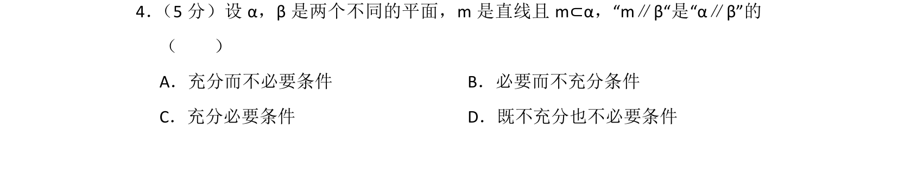
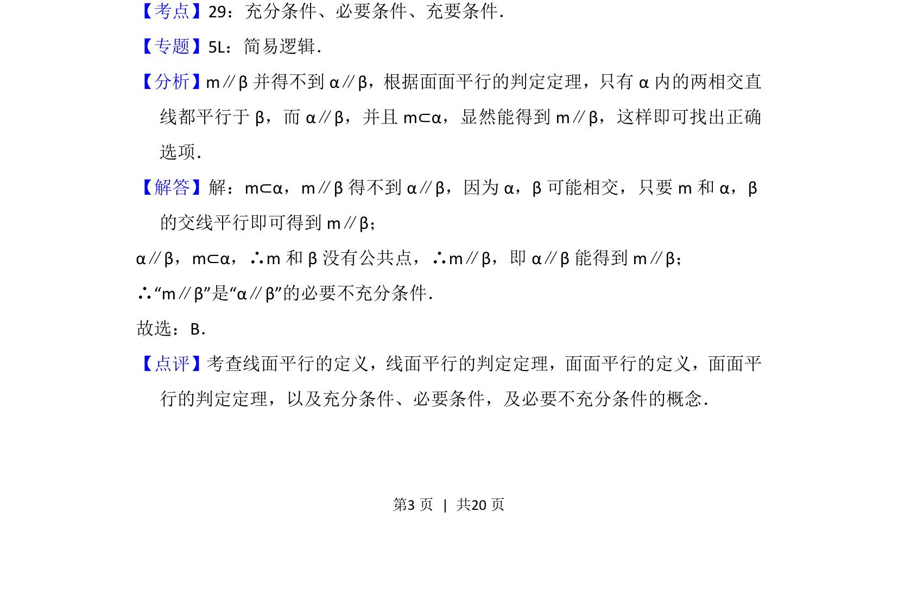

## 题面

## 摘要

考查线面平行与面面平行的关系及充分必要条件的判断

## 关联考点

- [[533-充分必要条件|充分条件与必要条件]]
- [[352-空间直线平面平行|线面平行]]
- [[352-空间直线平面平行|面面平行]]

## 答案与解析

> 📄 原 PDF 第 3 页：`素材/真题/北京/2008-2024·（北京）数学高考真题/2015年高考数学试卷（理）（北京）（解析卷）.pdf`

<!-- 题干文本-start -->
## 题干文本
4． （5分）设α，β是两个不同的平面，m是直线且m⊂α，“m∥β“是“α∥β”的
（　　）
A．充分而不必要条件B．必要而不充分条件
C．充分必要条件D．既不充分也不必要条件
<!-- 题干文本-end -->

<!-- 解析文本-start -->
## 解析文本
【考点】29：充分条件、必要条件、充要条件．菁优网版权所有
【专题】5L：简易逻辑．
【分析】m∥β并得不到α∥β，根据面面平行的判定定理，只有α内的两相交直
线都平行于β，而α∥β，并且m⊂α，显然能得到m∥β，这样即可找出正确
选项．
【解答】解：m⊂α，m∥β得不到α∥β，因为α，β可能相交，只要m和α，β
的交线平行即可得到m∥β；
α∥β，m⊂α，∴m和β没有公共点，∴m∥β，即α∥β能得到m∥β；
∴“m∥β”是“α∥β”的必要不充分条件．
故选：B．
【点评】考查线面平行的定义，线面平行的判定定理，面面平行的定义，面面平
行的判定定理，以及充分条件、必要条件，及必要不充分条件的概念．
<!-- 解析文本-end -->
