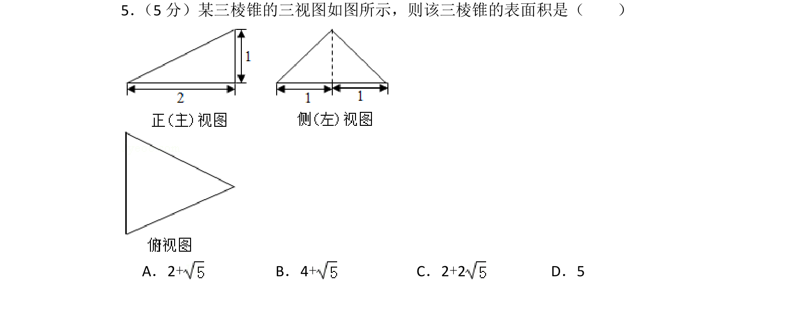
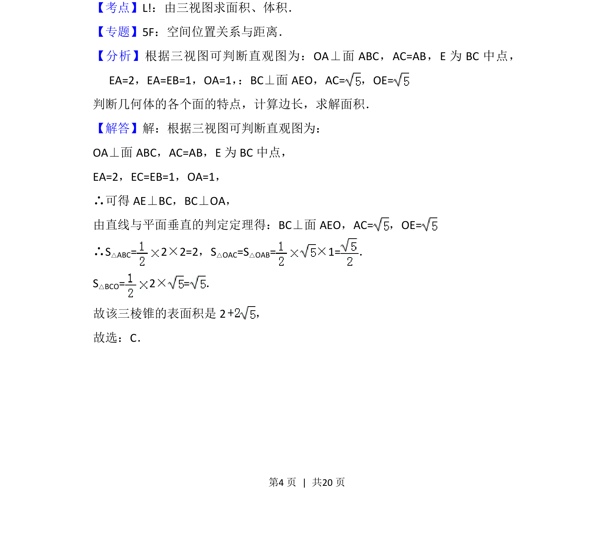
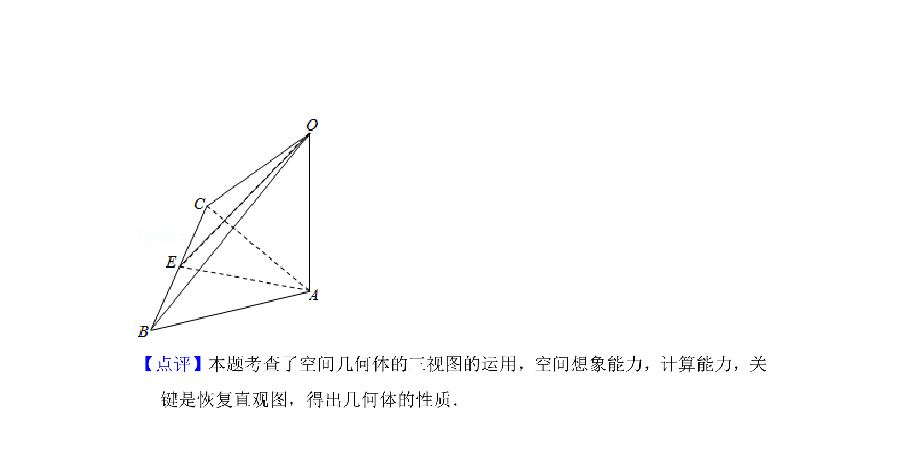

## 题面

## 摘要

根据三视图还原三棱锥，利用空间垂直关系计算各面面积求表面积。

## 关联考点

- [[1056-立体图形还原|三视图还原几何体]]
- [[1388-棱锥的表面积|棱锥的表面积]]
- [[空间垂直]]

## 答案与解析

> 📄 原 PDF 第 4 页：`素材/真题/北京/2008-2024·（北京）数学高考真题/2015年高考数学试卷（理）（北京）（解析卷）.pdf`
