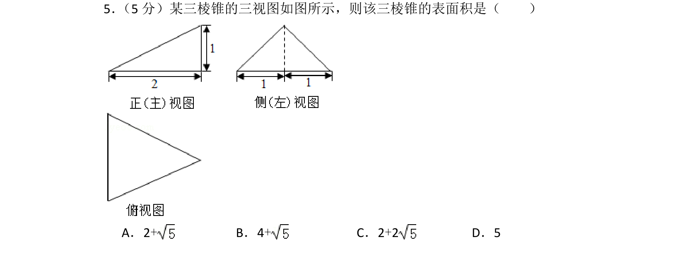
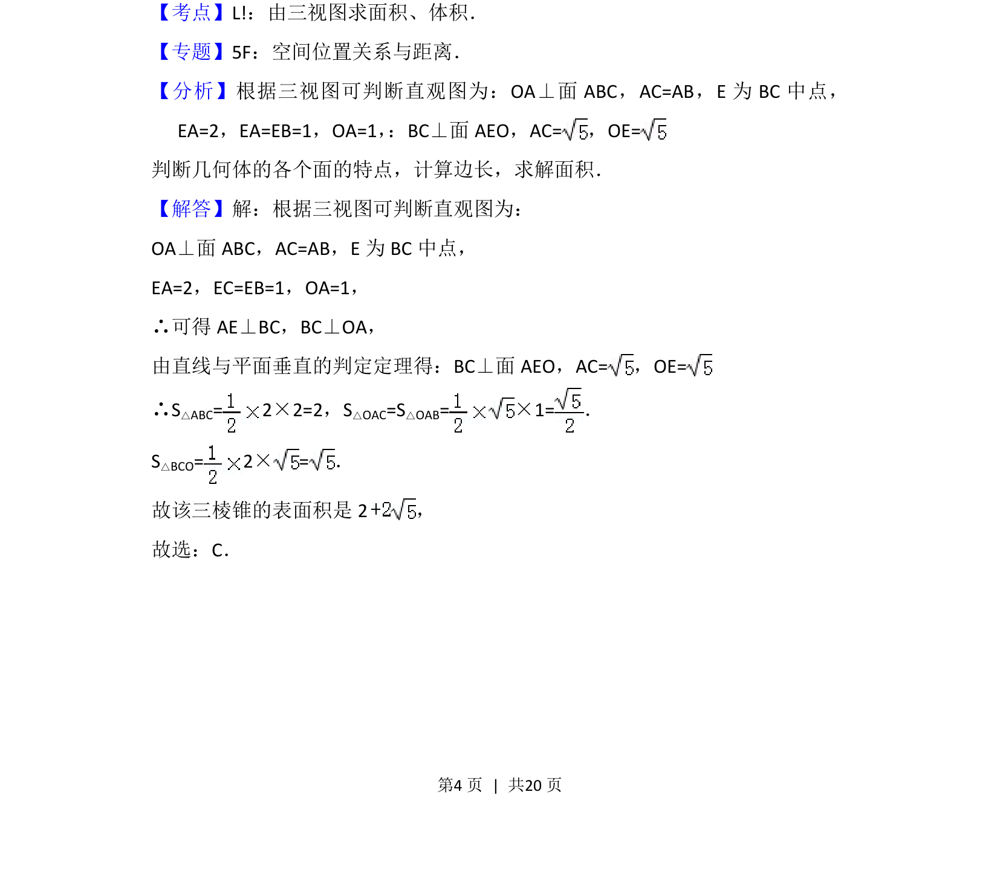
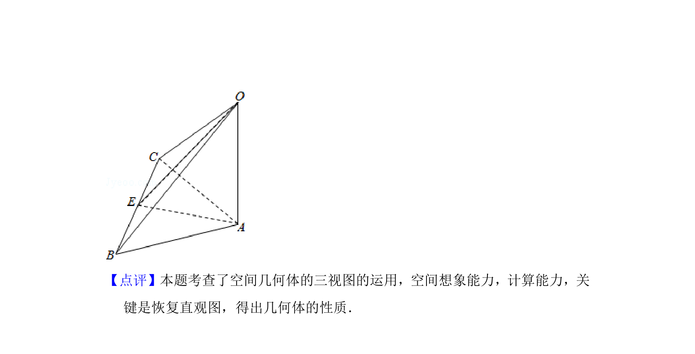

## 题面

## 摘要

根据三视图还原三棱锥，利用空间垂直关系计算各面面积求表面积。

## 关联考点

- [[1056-立体图形还原|三视图还原几何体]]
- [[1388-棱锥的表面积|棱锥的表面积]]
- [[空间垂直]]

## 答案与解析

> 📄 原 PDF 第 4 页：`素材/真题/北京/2008-2024·（北京）数学高考真题/2015年高考数学试卷（理）（北京）（解析卷）.pdf`

<!-- 题干文本-start -->
## 题干文本
5． （5分）某三棱锥的三视图如图所示，则该三棱锥的表面积是（　　）
A．2+B．4+C．2+2 D．5
<!-- 题干文本-end -->

<!-- 解析文本-start -->
## 解析文本
【考点】L!：由三视图求面积、体积．菁优网版权所有
【专题】5F：空间位置关系与距离．
【分析】根据三视图可判断直观图为：OA⊥面ABC，AC=AB，E为BC中点，
EA=2，EA=EB=1，OA=1， ：BC⊥面AEO，AC=，OE=
判断几何体的各个面的特点，计算边长，求解面积．
【解答】解：根据三视图可判断直观图为：
OA⊥面ABC，AC=AB，E为BC中点，
EA=2，EC=EB=1，OA=1，
∴可得AE⊥BC，BC⊥OA，
由直线与平面垂直的判定定理得：BC⊥面AEO，AC=，OE=
∴S△ABC= 2×2=2，S △OAC=S△OAB=×1=．
S△BCO= 2×=．
故该三棱锥的表面积是2，
故选：C．
<!-- 解析文本-end -->
