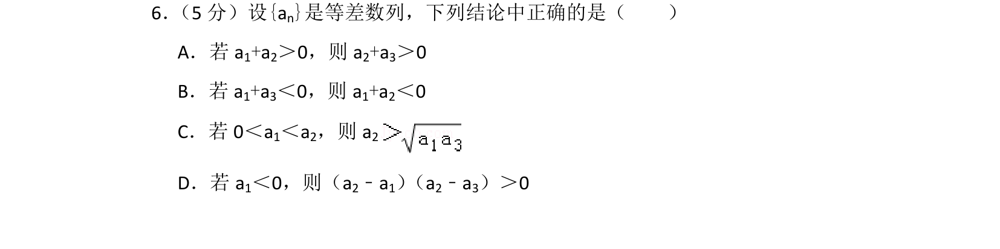
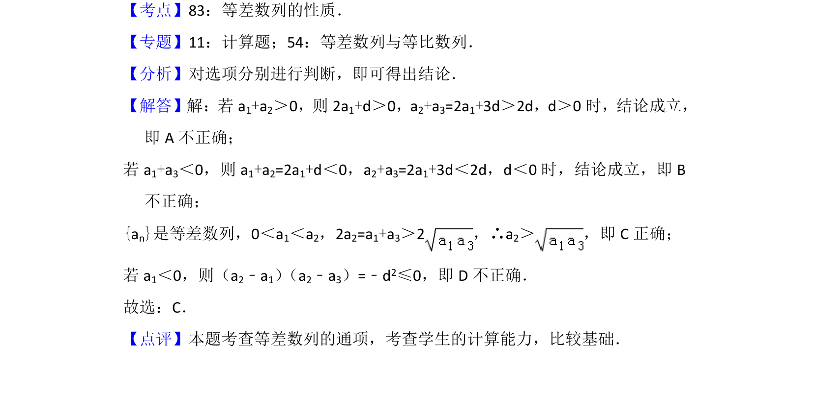

## 题面

## 摘要

本题考查等差数列的通项公式与性质，通过反例或推理判断命题真假。

## 关联考点

- [[412-等差数列性质|等差数列的性质]]
- [[1063-等差数列通项公式|等差数列的通项公式]]
- [[765-命题真假判断|命题真假判断]]

## 答案与解析

> 📄 原 PDF 第 5 页：`素材/真题/北京/2008-2024·（北京）数学高考真题/2015年高考数学试卷（理）（北京）（解析卷）.pdf`

<!-- 题干文本-start -->
## 题干文本
6． （5分）设{an}是等差数列，下列结论中正确的是（　　）
A．若a 1+a2＞0，则a 2+a3＞0
B．若a 1+a3＜0，则a 1+a2＜0
C．若0＜a 1＜a2，则a 2
D．若a 1＜0，则（a2﹣a1） （a2﹣a3）＞0
<!-- 题干文本-end -->

<!-- 解析文本-start -->
## 解析文本
【考点】83：等差数列的性质．菁优网版权所有
【专题】11：计算题；54：等差数列与等比数列．
【分析】对选项分别进行判断，即可得出结论．
【解答】解：若a1+a2＞0，则2a 1+d＞0，a2+a3=2a1+3d＞2d，d＞0时，结论成立，
即A不正确；
若a 1+a3＜0，则a 1+a2=2a1+d＜0，a2+a3=2a1+3d＜2d，d＜0时，结论成立，即B
不正确；
{an}是等差数列，0＜a1＜a2，2a2=a1+a3＞2，∴a 2＞ ，即C正确；
若a 1＜0，则（a2﹣a1） （a2﹣a3）=﹣d2≤0，即D不正确．
故选：C．
【点评】本题考查等差数列的通项，考查学生的计算能力，比较基础．
<!-- 解析文本-end -->
