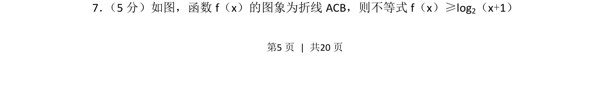
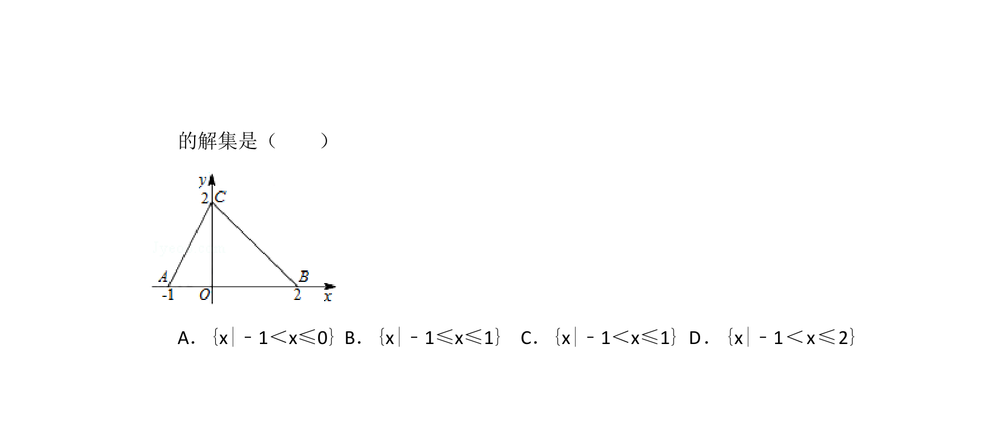
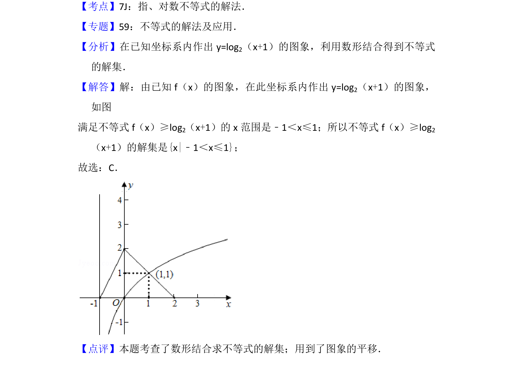

## 题面

## 摘要

根据函数图象解 f(x) ≥ log₂(x+1) 的对数不等式。

## 关联考点

- [[187-函数图象|函数图象]]
- [[对数不等式]]
- [[897-数形结合|数形结合]]

## 答案与解析

> 📄 原 PDF 第 5 页：`素材/真题/北京/2008-2024·（北京）数学高考真题/2015年高考数学试卷（理）（北京）（解析卷）.pdf`
