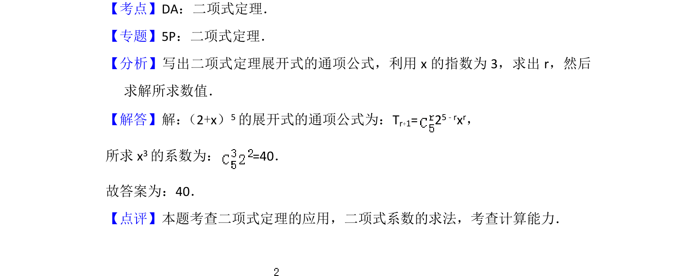

## 题面

## 摘要

考查二项式定理展开式中特定项系数的求解。

## 关联考点

- [[472-二项式定理|二项式定理]]
- [[384-数列通项公式|通项公式]]
- [[197-待定系数法|系数]]

## 答案与解析

> 📄 原 PDF 第 8 页：`素材/真题/北京/2008-2024·（北京）数学高考真题/2015年高考数学试卷（理）（北京）（解析卷）.pdf`

<!-- 题干文本-start -->
## 题干文本
9． （5分）在（2+x）5的展开式中，x3的系数为　40　（用数字作答）
<!-- 题干文本-end -->

<!-- 解析文本-start -->
## 解析文本
【考点】DA：二项式定理．菁优网版权所有
【专题】5P：二项式定理．
【分析】写出二项式定理展开式的通项公式，利用x的指数为3，求出r，然后
求解所求数值．
【解答】解： （2+x）5的展开式的通项公式为：Tr+1= 2 5﹣rxr，
所求x 3的系数为：=40．
故答案为：40．
【点评】本题考查二项式定理的应用，二项式系数的求法，考查计算能力．
<!-- 解析文本-end -->
