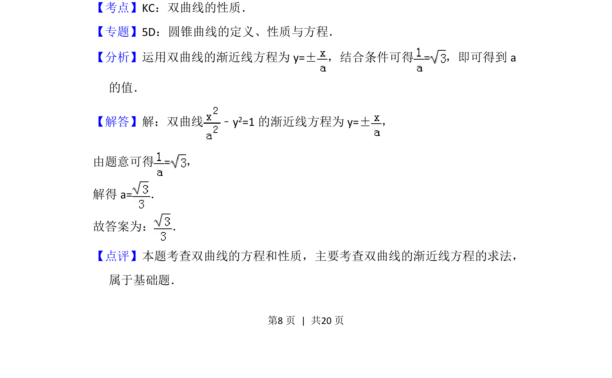

## 题面

## 摘要

求双曲线方程中参数，利用渐近线条件解题。

## 关联考点

- [[367-双曲线几何性质|双曲线性质]]
- [[975-渐近线方程|渐近线方程]]

## 答案与解析

> 📄 原 PDF 第 8 页：`素材/真题/北京/2008-2024·（北京）数学高考真题/2015年高考数学试卷（理）（北京）（解析卷）.pdf`

<!-- 题干文本-start -->
## 题干文本
10． （5分）已知双曲线﹣y 2=1（a＞0）的一条渐近线为x+y=0，则a=　
　．
<!-- 题干文本-end -->

<!-- 解析文本-start -->
## 解析文本
【考点】KC：双曲线的性质．菁优网版权所有
【专题】5D：圆锥曲线的定义、性质与方程．
【分析】运用双曲线的渐近线方程为y=±，结合条件可得=，即可得到a
的值．
【解答】解：双曲线﹣y 2=1的渐近线方程为y=±，
由题意可得=，
解得a=．
故答案为： ．
【点评】本题考查双曲线的方程和性质，主要考查双曲线的渐近线方程的求法，
属于基础题．
<!-- 解析文本-end -->
