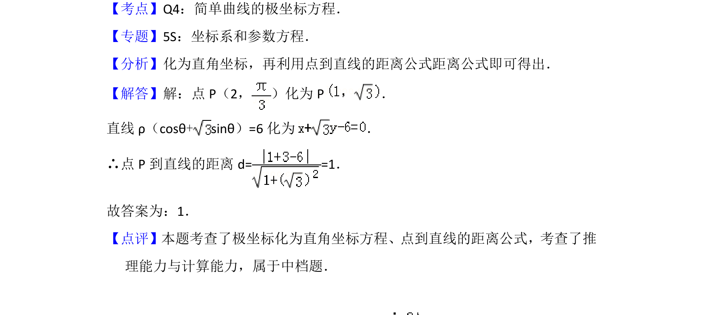

## 题面

## 摘要

极坐标方程化为直角坐标方程，并求点到直线的距离。

## 关联考点

- [[920-极坐标与直角坐标互化|极坐标与直角坐标互化]]
- [[570-点到直线的距离公式|点到直线的距离公式]]

## 答案与解析

> 📄 原 PDF 第 9 页：`素材/真题/北京/2008-2024·（北京）数学高考真题/2015年高考数学试卷（理）（北京）（解析卷）.pdf`

<!-- 题干文本-start -->
## 题干文本
11． （5分）在极坐标系中，点（2， ）到直线ρ（cosθ+sinθ）=6的距离为　
1　．
<!-- 题干文本-end -->

<!-- 解析文本-start -->
## 解析文本
【考点】Q4：简单曲线的极坐标方程．菁优网版权所有
【专题】5S：坐标系和参数方程．
【分析】化为直角坐标，再利用点到直线的距离公式距离公式即可得出．
【解答】解：点P（2， ）化为P．
直线ρ（cosθ+sinθ）=6化为 ．
∴点P到直线的距离d= =1．
故答案为：1．
【点评】本题考查了极坐标化为直角坐标方程、点到直线的距离公式，考查了推
理能力与计算能力，属于中档题．
<!-- 解析文本-end -->
