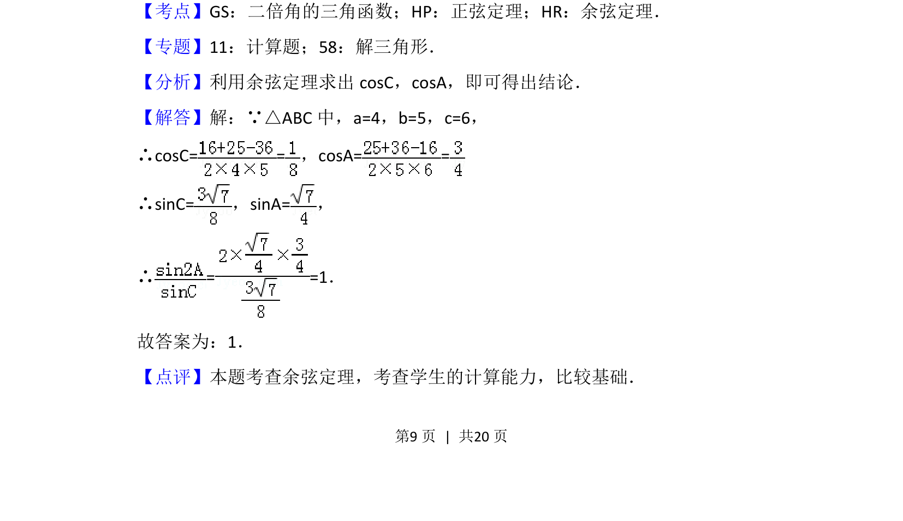

## 题面

## 摘要

在三角形中已知三边，利用余弦定理求角，进而求三角函数比值。

## 关联考点

- [[126-定理|余弦定理]]
- [[126-定理|正弦定理]]
- [[638-二倍角的三角函数|二倍角的三角函数]]

## 答案与解析

> 📄 原 PDF 第 9 页：`素材/真题/北京/2008-2024·（北京）数学高考真题/2015年高考数学试卷（理）（北京）（解析卷）.pdf`
