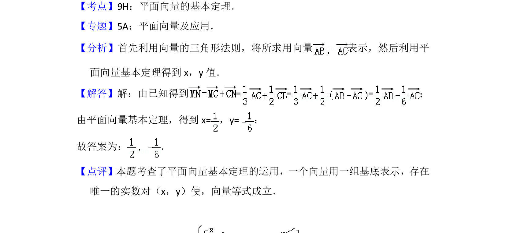

## 题面

## 摘要

在三角形中利用向量的线性运算和平面向量基本定理，将向量用基底表示并求系数。

## 关联考点

- [[336-平面向量基本定理|平面向量基本定理]]
- [[543-向量的线性运算|向量的线性运算]]

## 答案与解析

> 📄 原 PDF 第 10 页：`素材/真题/北京/2008-2024·（北京）数学高考真题/2015年高考数学试卷（理）（北京）（解析卷）.pdf`
