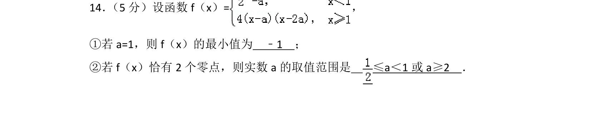
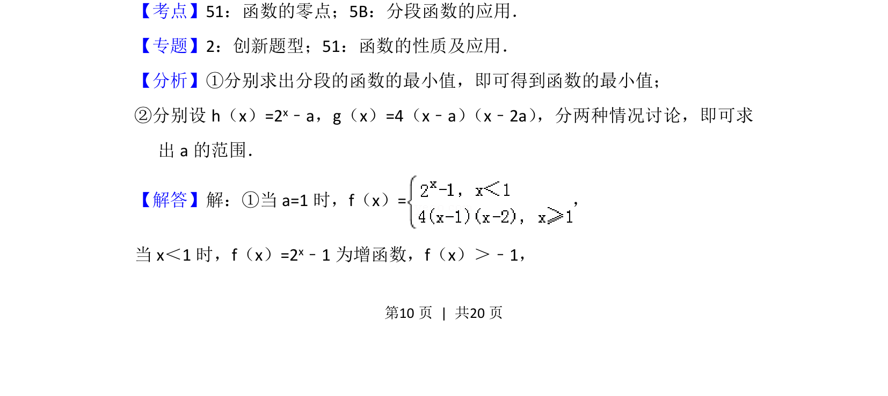
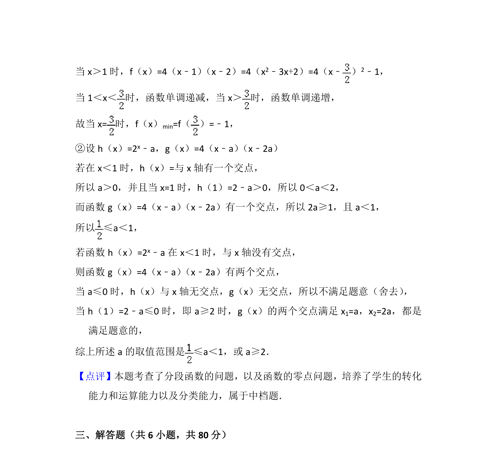

## 题面

## 摘要

考查分段函数最值及根据零点个数求参数范围。

## 关联考点

- [[分段函数应用]]
- [[288-函数零点|函数的零点]]
- [[726-参数范围|参数范围]]

## 答案与解析

> 📄 原 PDF 第 10 页：`素材/真题/北京/2008-2024·（北京）数学高考真题/2015年高考数学试卷（理）（北京）（解析卷）.pdf`

<!-- 题干文本-start -->
## 题干文本
14． （5分）设函数f（x）=，
①若a=1，则f（x）的最小值为　﹣1　；
②若f（x）恰有2个零点，则实数a的取值范围是　 ≤a＜1或a≥2　．
<!-- 题干文本-end -->

<!-- 解析文本-start -->
## 解析文本
【考点】51：函数的零点；5B：分段函数的应用．菁优网版权所有
【专题】2：创新题型；51：函数的性质及应用．
【分析】①分别求出分段的函数的最小值，即可得到函数的最小值；
②分别设h（x）=2 x﹣a，g（x）=4（x﹣a） （x﹣2a） ，分两种情况讨论，即可求
出a的范围．
【解答】解：①当a=1时，f（x）=，
当x＜1时，f（x）=2 x﹣1为增函数，f（x）＞﹣1，
<!-- 解析文本-end -->
