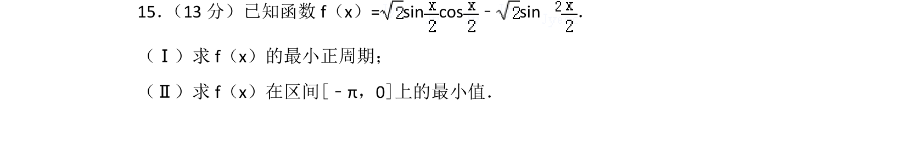
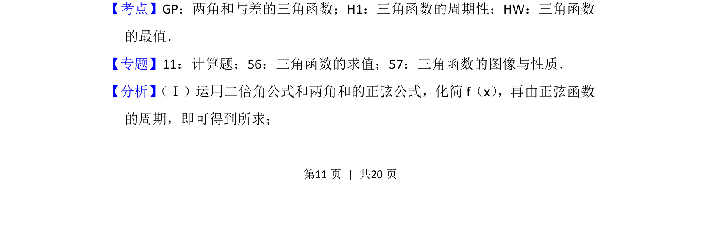
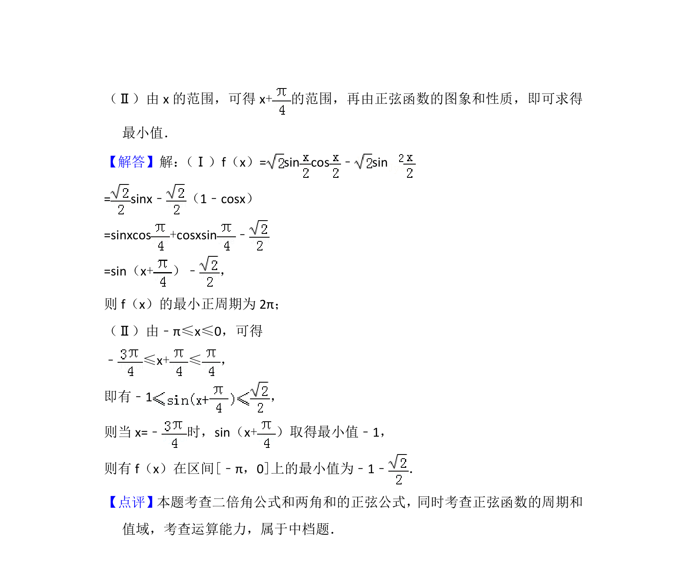

## 题面

## 摘要

求正弦型函数最小正周期及闭区间最值

## 关联考点

- [[628-两角和与差的三角函数|两角和与差的三角函数]]
- [[611-三角函数的周期性|三角函数的周期性]]
- [[615-三角函数的最值|三角函数的最值]]

## 答案与解析

> 📄 原 PDF 第 11 页：`素材/真题/北京/2008-2024·（北京）数学高考真题/2015年高考数学试卷（理）（北京）（解析卷）.pdf`
