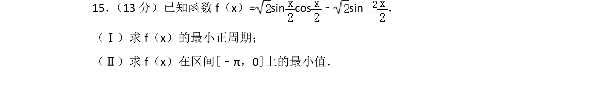
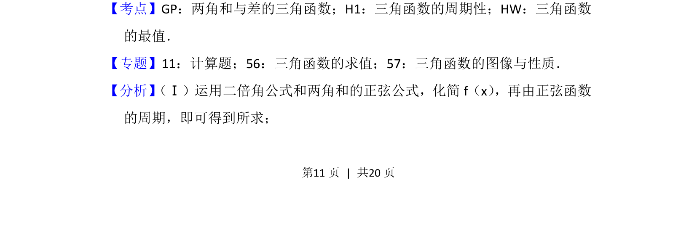
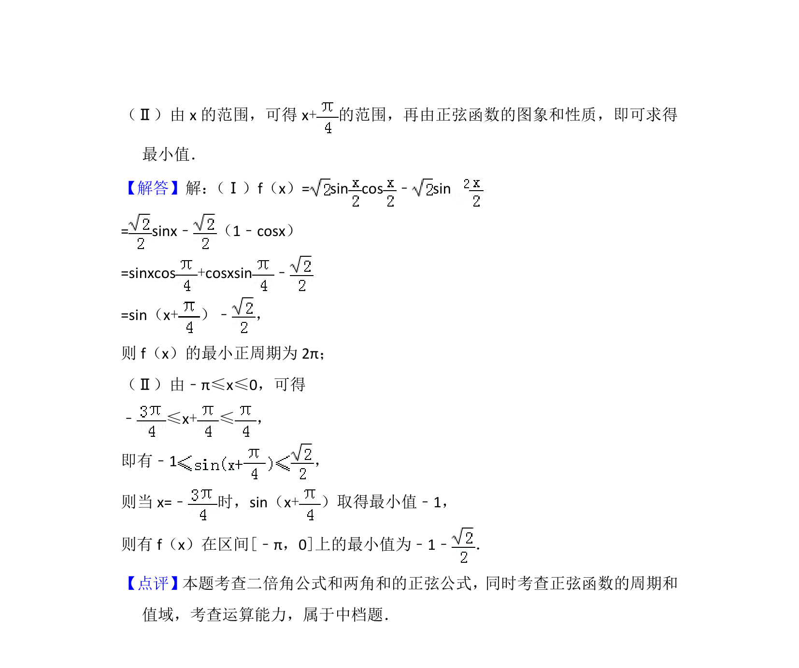

## 题面

## 摘要

求正弦型函数最小正周期及闭区间最值

## 关联考点

- [[628-两角和与差的三角函数|两角和与差的三角函数]]
- [[611-三角函数的周期性|三角函数的周期性]]
- [[615-三角函数的最值|三角函数的最值]]

## 答案与解析

> 📄 原 PDF 第 11 页：`素材/真题/北京/2008-2024·（北京）数学高考真题/2015年高考数学试卷（理）（北京）（解析卷）.pdf`

<!-- 题干文本-start -->
## 题干文本
15． （13分）已知函数f（x）= sin cos﹣sin．
（Ⅰ）求f（x）的最小正周期；
（Ⅱ）求f（x）在区间[﹣π，0]上的最小值．
<!-- 题干文本-end -->

<!-- 解析文本-start -->
## 解析文本
【考点】GP：两角和与差的三角函数；H1：三角函数的周期性；HW：三角函数
的最值．菁优网版权所有
【专题】11：计算题；56：三角函数的求值；57：三角函数的图像与性质．
【分析】 （Ⅰ）运用二倍角公式和两角和的正弦公式，化简f（x） ，再由正弦函数
的周期，即可得到所求；
<!-- 解析文本-end -->
