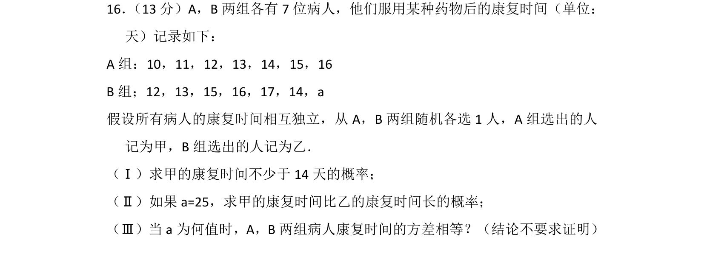
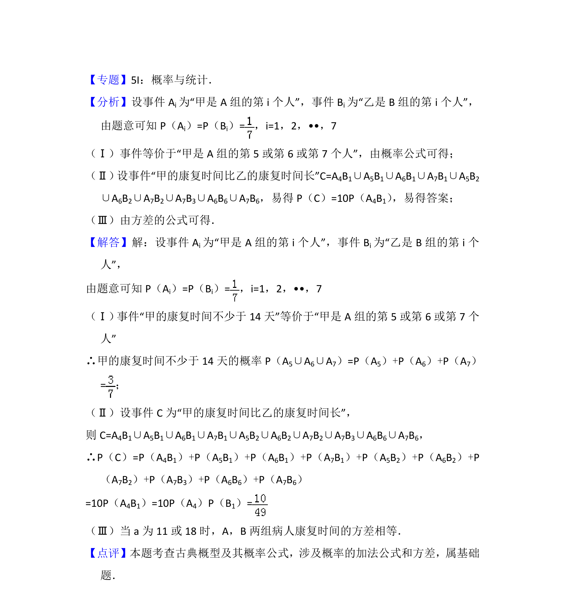

## 题面

## 摘要

本题通过两组病人的康复时间数据，考查古典概型的概率计算及方差性质的应用。

## 关联考点

- [[古典概型及其概率计算公式]]
- [[922-极差|极差]]
- [[1356-方差与标准差|方差与标准差]]

## 答案与解析

> 📄 原 PDF 第 12 页：`素材/真题/北京/2008-2024·（北京）数学高考真题/2015年高考数学试卷（理）（北京）（解析卷）.pdf`
