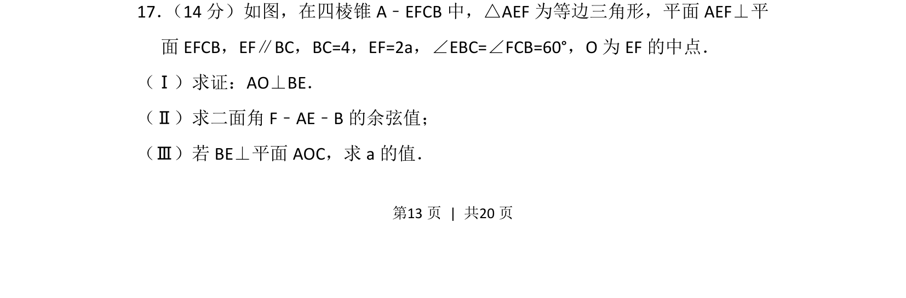
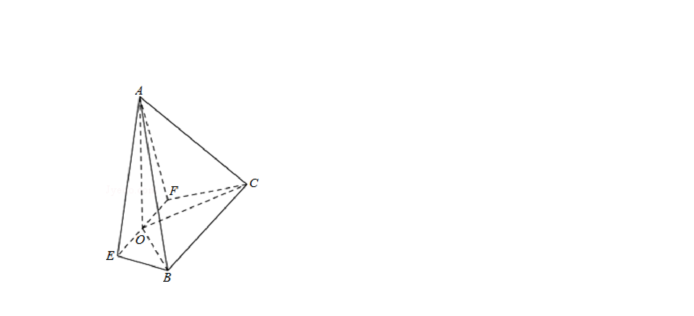
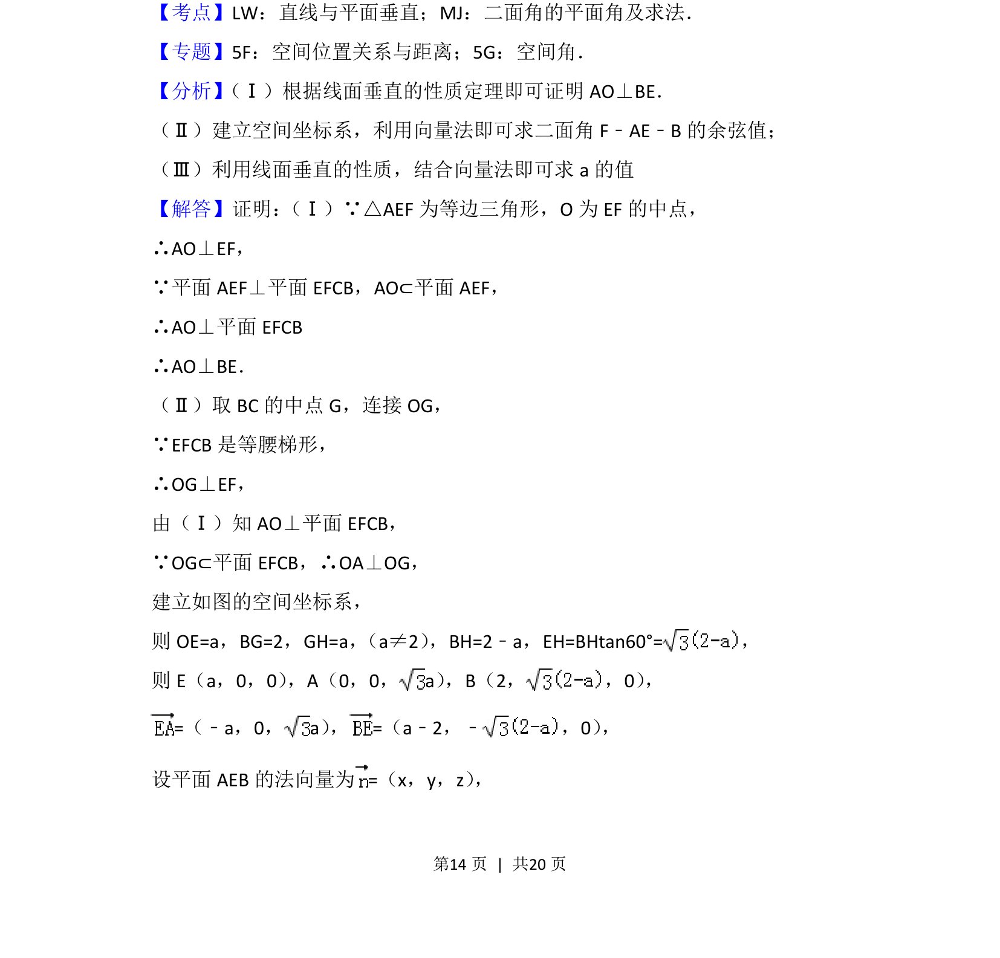
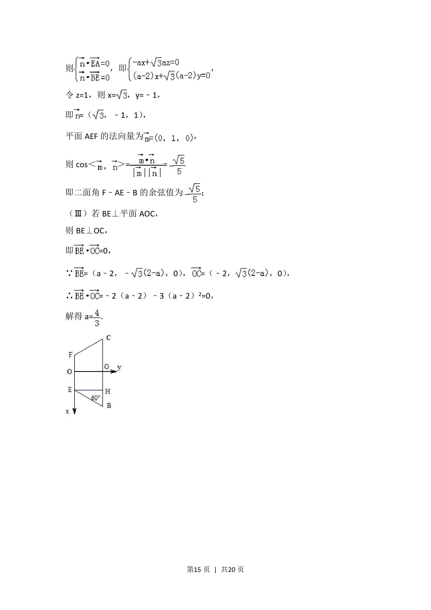
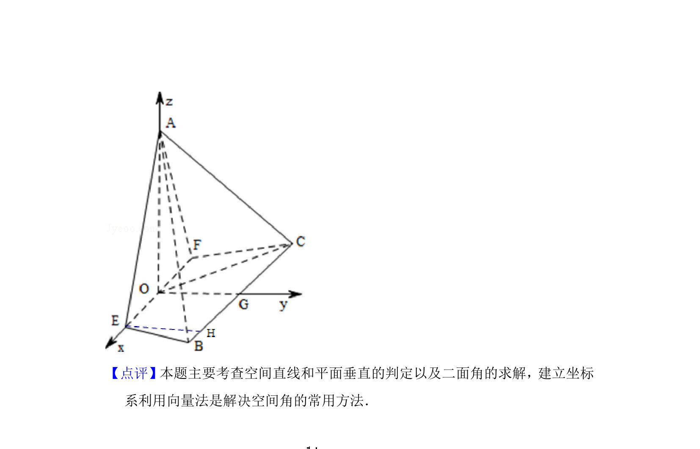

## 题面

## 摘要

本题为立体几何综合题，涉及面面垂直、线线垂直证明、二面角求解及参数计算。

## 关联考点

- [[593-面面垂直性质|面面垂直性质]]
- [[1355-线面垂直判定|线面垂直判定]]
- [[353-空间角|二面角]]
- [[579-空间向量法|空间向量法]]

## 答案与解析

> 📄 原 PDF 第 13 页：`素材/真题/北京/2008-2024·（北京）数学高考真题/2015年高考数学试卷（理）（北京）（解析卷）.pdf`
