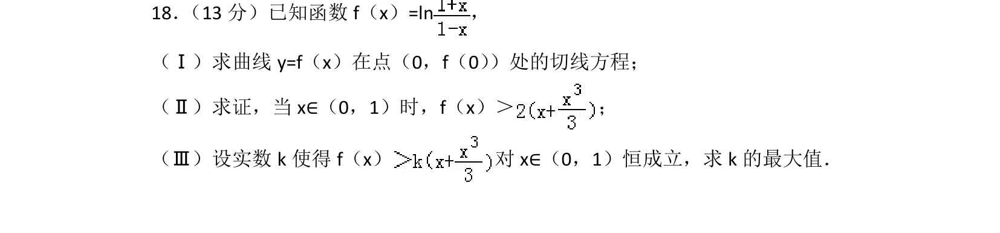
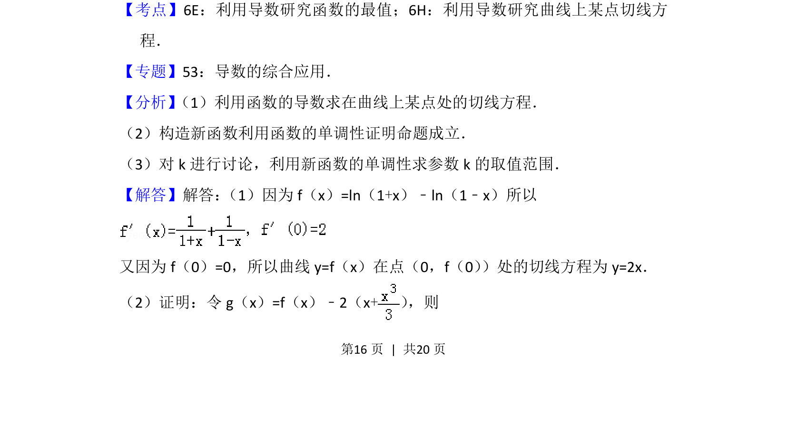
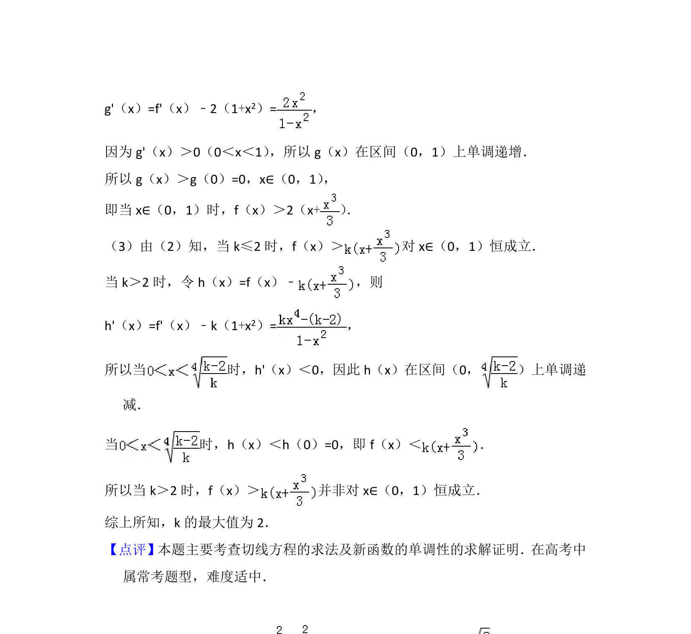

## 题面

## 摘要

本题考查利用导数求曲线切线方程、证明函数不等式及解决恒成立问题求参数最值。

## 关联考点

- [[706-利用导数研究函数的最值|利用导数研究函数的最值]]
- [[710-利用导数研究曲线上某点切线方程|利用导数研究曲线上某点切线方程]]
- [[443-导数综合应用|导数综合应用]]

## 答案与解析

> 📄 原 PDF 第 16 页：`素材/真题/北京/2008-2024·（北京）数学高考真题/2015年高考数学试卷（理）（北京）（解析卷）.pdf`

<!-- 题干文本-start -->
## 题干文本
18． （13分）已知函数f（x）=ln，
（Ⅰ）求曲线y=f（x）在点（0，f（0） ）处的切线方程；
（Ⅱ）求证，当x∈（0，1）时，f（x）＞ ；
（Ⅲ）设实数k使得f（x） 对x∈（0，1）恒成立，求k的最大值．
<!-- 题干文本-end -->

<!-- 解析文本-start -->
## 解析文本
【考点】6E：利用导数研究函数的最值；6H：利用导数研究曲线上某点切线方
程．菁优网版权所有
【专题】53：导数的综合应用．
【分析】 （1）利用函数的导数求在曲线上某点处的切线方程．
（2）构造新函数利用函数的单调性证明命题成立．
（3）对k进行讨论，利用新函数的单调性求参数k的取值范围．
【解答】解答： （1）因为f（x）=ln（1+x）﹣ln（1﹣x）所以
又因为f（0）=0，所以曲线y=f（x）在点（0，f（0） ）处的切线方程为y=2x．
（2）证明：令g（x）=f（x）﹣2（x+） ，则
<!-- 解析文本-end -->
