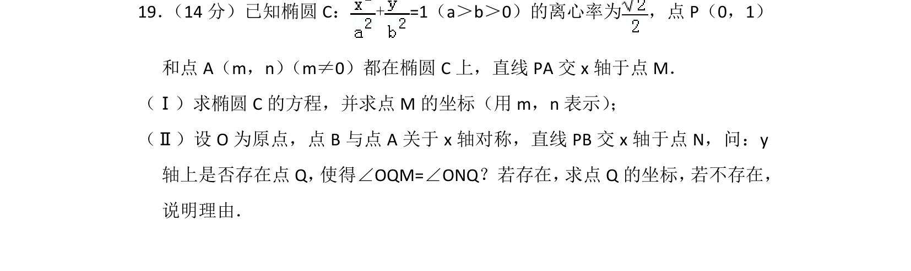
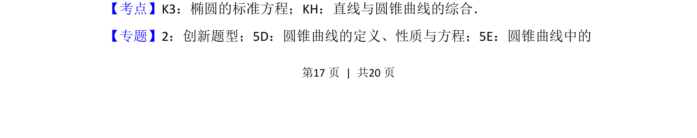
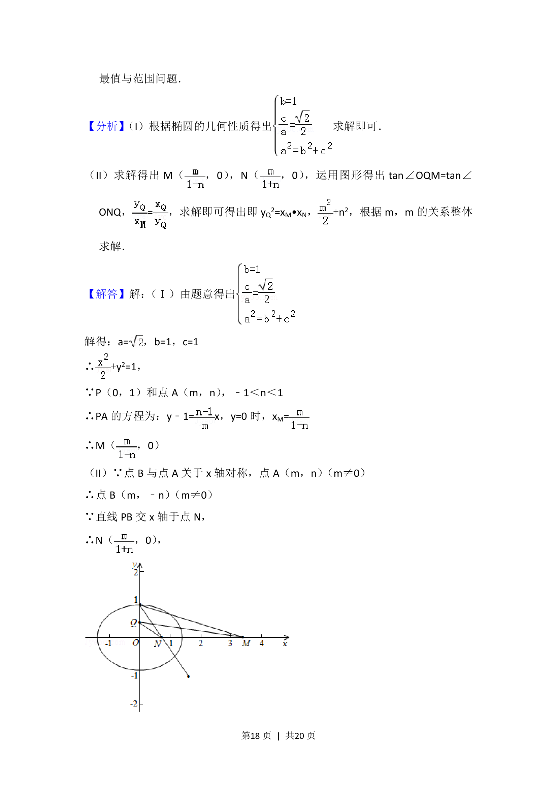
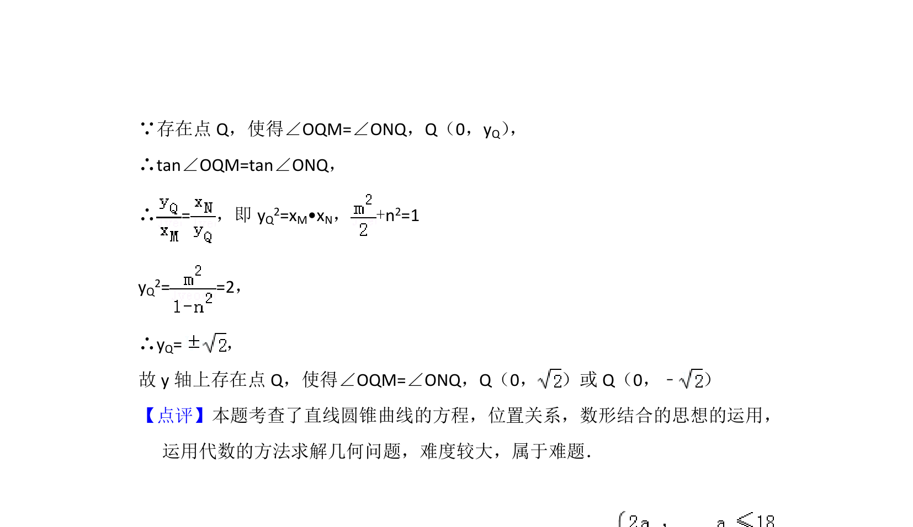

## 题面

## 摘要

考查椭圆标准方程、离心率、直线与圆锥曲线交点及存在性探究问题。

## 关联考点

- [[061-方程|椭圆的标准方程]]
- [[1007-直线与圆锥曲线的综合|直线与圆锥曲线的综合]]
- [[391-椭圆离心率|离心率]]
- [[428-存在性问题|存在性问题]]

## 答案与解析

> 📄 原 PDF 第 17 页：`素材/真题/北京/2008-2024·（北京）数学高考真题/2015年高考数学试卷（理）（北京）（解析卷）.pdf`

<!-- 题干文本-start -->
## 题干文本
19． （14分）已知椭圆C：+=1（a＞b＞0）的离心率为 ，点P（0，1）
和点A（m，n） （m≠0）都在椭圆C上，直线PA交x轴于点M．
（Ⅰ）求椭圆C的方程，并求点M的坐标（用m，n表示） ；
（Ⅱ）设O为原点，点B与点A关于x轴对称，直线PB交x轴于点N，问：y
轴上是否存在点Q， 使得∠OQM=∠ONQ？若存在， 求点Q的坐标， 若不存在，
说明理由．
<!-- 题干文本-end -->

<!-- 解析文本-start -->
## 解析文本
【考点】K3：椭圆的标准方程；KH：直线与圆锥曲线的综合．菁优网版权所有
【专题】2：创新题型；5D：圆锥曲线的定义、性质与方程；5E：圆锥曲线中的
<!-- 解析文本-end -->
