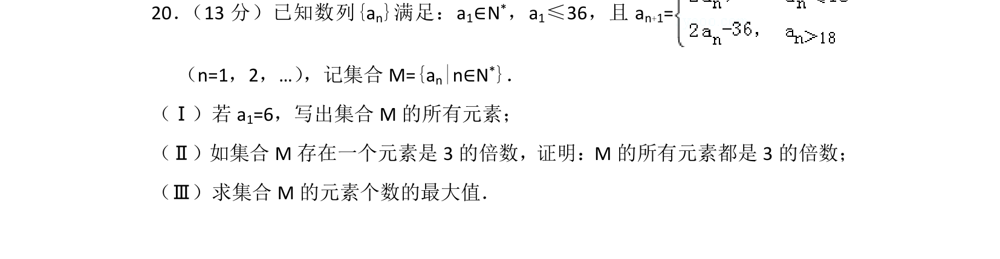
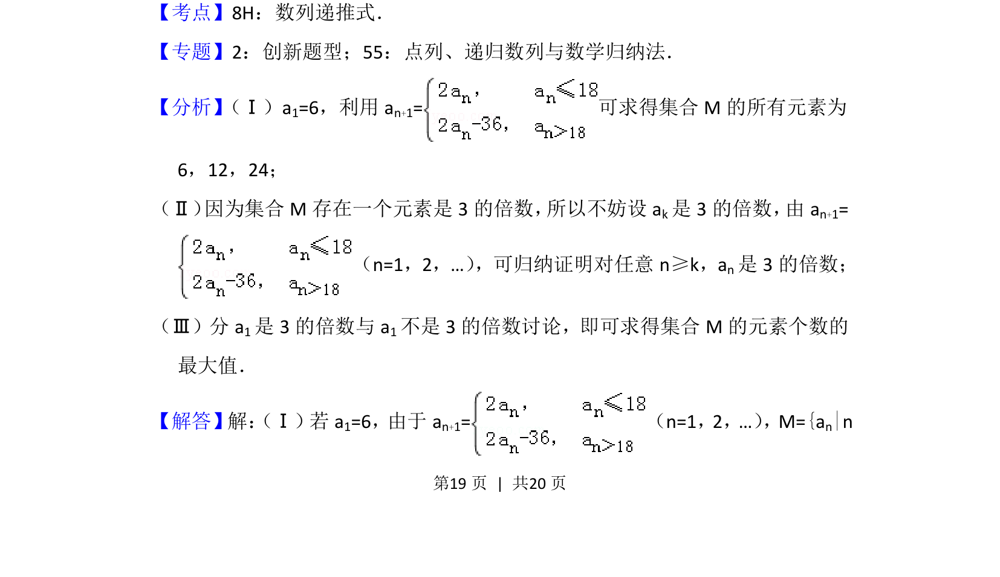
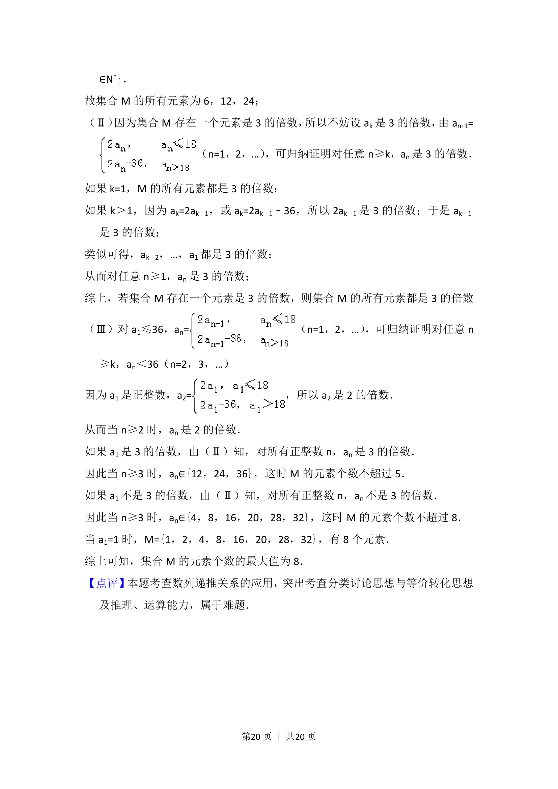

## 题面

## 摘要

已知数列递推定义集合，判断元素性质并求元素个数最大值。

## 关联考点

- [[895-数列递推式|数列递推式]]
- [[386-数学归纳法-初步|数学归纳法]]
- [[整除性]]
- [[424-参数分类讨论|分类讨论]]

## 答案与解析

> 📄 原 PDF 第 19 页：`素材/真题/北京/2008-2024·（北京）数学高考真题/2015年高考数学试卷（理）（北京）（解析卷）.pdf`
