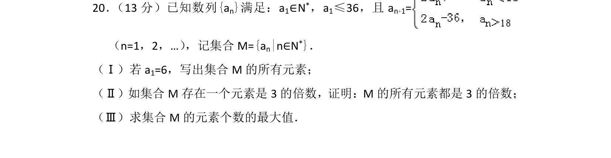
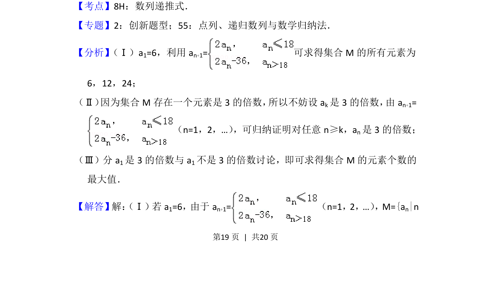
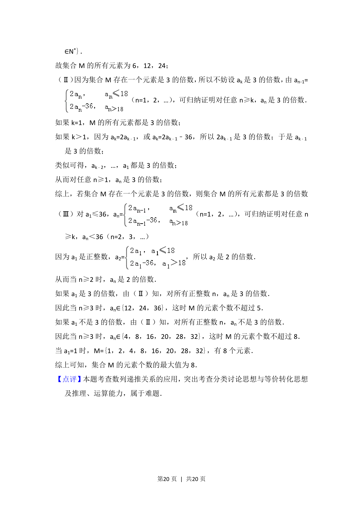

## 题面

## 摘要

已知数列递推定义集合，判断元素性质并求元素个数最大值。

## 关联考点

- [[894-数列递推式|数列递推式]]
- [[386-数学归纳法-初步|数学归纳法]]
- [[整除性]]
- [[424-参数分类讨论|分类讨论]]

## 答案与解析

> 📄 原 PDF 第 19 页：`素材/真题/北京/2008-2024·（北京）数学高考真题/2015年高考数学试卷（理）（北京）（解析卷）.pdf`

<!-- 题干文本-start -->
## 题干文本
20． （13分）已知数列{an}满足：a 1∈N*，a1≤36，且a n+1=
（n=1，2，…） ，记集合M={an|n∈N*}．
（Ⅰ）若a 1=6，写出集合M的所有元素；
（Ⅱ）如集合M存在一个元素是3的倍数，证明：M的所有元素都是3的倍数；
（Ⅲ）求集合M的元素个数的最大值．
<!-- 题干文本-end -->

<!-- 解析文本-start -->
## 解析文本
【考点】8H：数列递推式．菁优网版权所有
【专题】2：创新题型；55：点列、递归数列与数学归纳法．
【分析】 （Ⅰ）a1=6，利用a n+1=可求得集合M的所有元素为
6，12，24；
（Ⅱ） 因为集合M存在一个元素是3的倍数， 所以不妨设ak是3的倍数， 由an+1=
（n=1，2，…） ，可归纳证明对任意n≥k，an是3的倍数；
（Ⅲ）分a 1是3的倍数与a 1不是3的倍数讨论，即可求得集合M的元素个数的
最大值．
【解答】解： （Ⅰ）若a1=6，由于an+1=（n=1，2，…） ，M={a n|n
<!-- 解析文本-end -->
