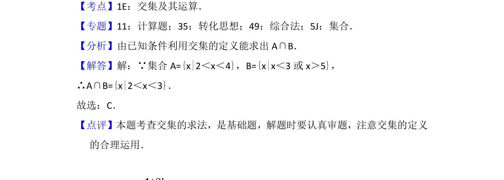

## 题面

## 摘要

已知两个集合，求交集，考查交集定义及运算。

## 关联考点

- [[042-集合|集合]]
- [[645-交集及其运算|交集及其运算]]

## 答案与解析

> 📄 原 PDF 第 1 页：`素材/真题/北京/2008-2024·（北京）数学高考真题/2016年高考数学试卷（文）（北京）（解析卷）.pdf`

<!-- 题干文本-start -->
## 题干文本
1． （5分）已知集合A={x|2＜x＜4}，B={x|x＜3或x＞5}，则A∩B=（　　）
A．{x|2＜x＜5}B．{x|x＜4或x＞5}C．{x|2＜x＜3}
D．{x|x＜2或x＞5}
<!-- 题干文本-end -->

<!-- 解析文本-start -->
## 解析文本
【考点】1E：交集及其运算．菁优网版权所有
【专题】11：计算题；35：转化思想；49：综合法；5J：集合．
【分析】由已知条件利用交集的定义能求出A∩B．
【解答】解：∵集合A={x|2＜x＜4}，B={x|x＜3或x＞5}，
∴A∩B={x|2＜x＜3}．
故选：C．
【点评】本题考查交集的求法，是基础题，解题时要认真审题，注意交集的定义
的合理运用．
<!-- 解析文本-end -->
