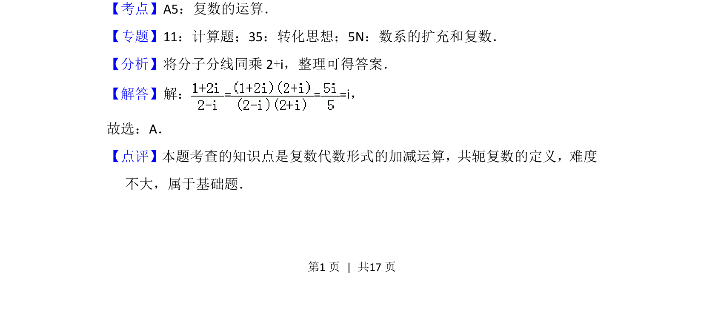

## 题面

## 摘要

本题主要考查复数代数形式的除法运算及共轭复数的基本概念。

## 关联考点

- [[811-复数运算|复数运算]]
- [[534-共轭复数|共轭复数]]
- [[除法运算]]

## 答案与解析

> 📄 原 PDF 第 1 页：`素材/真题/北京/2008-2024·（北京）数学高考真题/2016年高考数学试卷（文）（北京）（解析卷）.pdf`

<!-- 题干文本-start -->
## 题干文本
2． （5分）复数=（　　）
A．i B．1+i C．﹣i D．1﹣i
<!-- 题干文本-end -->

<!-- 解析文本-start -->
## 解析文本
【考点】A5：复数的运算．菁优网版权所有
【专题】11：计算题；35：转化思想；5N：数系的扩充和复数．
【分析】将分子分线同乘2+i，整理可得答案．
【解答】解：= = =i，
故选：A．
【点评】本题考查的知识点是复数代数形式的加减运算，共轭复数的定义，难度
不大，属于基础题．
<!-- 解析文本-end -->
