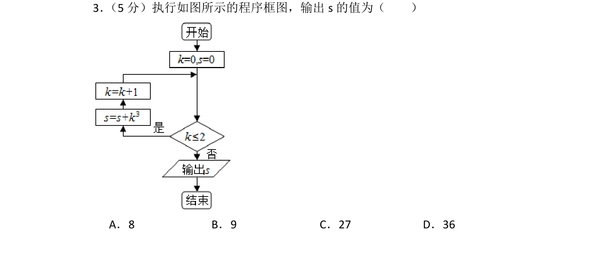
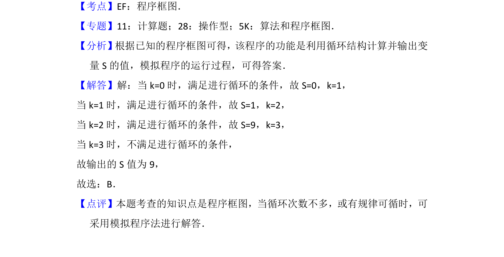

## 题面

## 摘要

执行程序框图，模拟循环过程计算输出S的值。

## 关联考点

- [[1042-程序框图|程序框图]]
- [[870-循环结构|循环结构]]
- [[模拟法]]

## 答案与解析

> 📄 原 PDF 第 2 页：`素材/真题/北京/2008-2024·（北京）数学高考真题/2016年高考数学试卷（文）（北京）（解析卷）.pdf`

<!-- 题干文本-start -->
## 题干文本
3． （5分）执行如图所示的程序框图，输出s的值为（　　）
A．8 B．9 C．27 D．36
<!-- 题干文本-end -->

<!-- 解析文本-start -->
## 解析文本
【考点】EF：程序框图．菁优网版权所有
【专题】11：计算题；28：操作型；5K：算法和程序框图．
【分析】根据已知的程序框图可得，该程序的功能是利用循环结构计算并输出变
量S的值，模拟程序的运行过程，可得答案．
【解答】解：当k=0时，满足进行循环的条件，故S=0，k=1，
当k=1时，满足进行循环的条件，故S=1，k=2，
当k=2时，满足进行循环的条件，故S=9，k=3，
当k=3时，不满足进行循环的条件，
故输出的S值为9，
故选：B．
【点评】本题考查的知识点是程序框图，当循环次数不多，或有规律可循时，可
采用模拟程序法进行解答．
<!-- 解析文本-end -->
