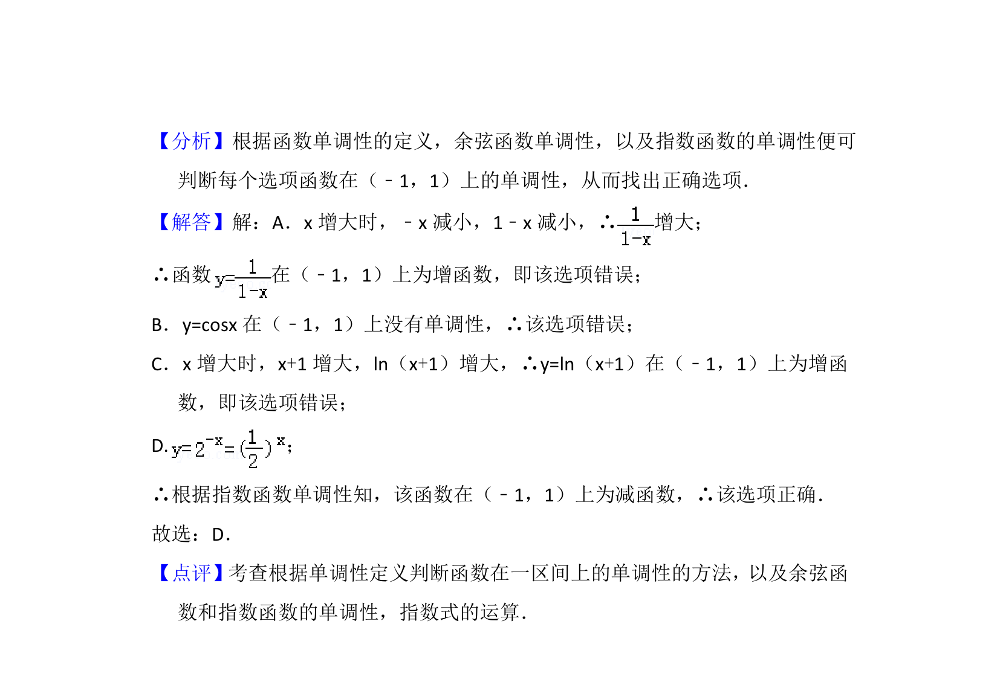

## 题面

## 摘要

本题考查基本初等函数在指定区间上的单调性判断，需逐一分析函数性质。

## 关联考点

- [[432-导数与函数单调性|函数单调性]]
- [[242-反比例函数定义|反比例函数]]
- [[276-余弦函数图象与性质|余弦函数]]
- [[298-对数函数|对数函数]]
- [[304-指数函数|指数函数]]

## 答案与解析

> 📄 原 PDF 第 2 页：`素材/真题/北京/2008-2024·（北京）数学高考真题/2016年高考数学试卷（文）（北京）（解析卷）.pdf`
