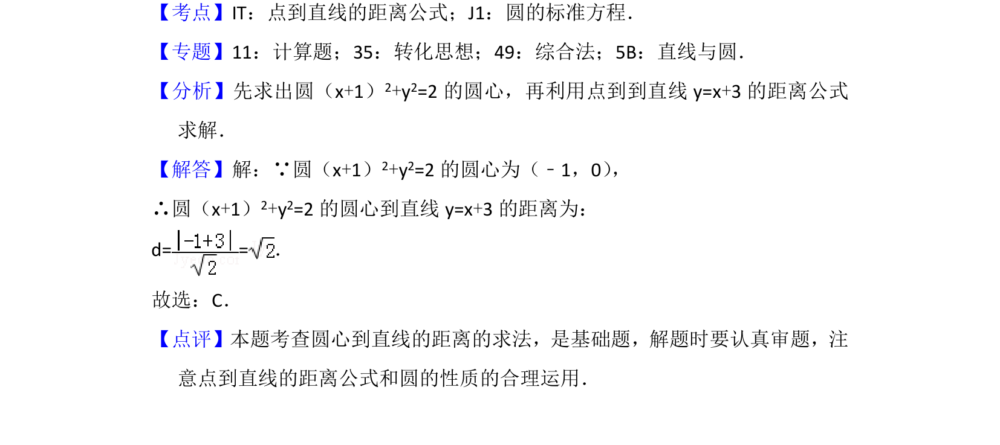

## 题面

## 摘要

本题通过圆的标准方程求圆心，再利用点到直线的距离公式计算距离。

## 关联考点

- [[373-圆的标准方程|圆的标准方程]]
- [[570-点到直线的距离公式|点到直线的距离公式]]

## 答案与解析

> 📄 原 PDF 第 3 页：`素材/真题/北京/2008-2024·（北京）数学高考真题/2016年高考数学试卷（文）（北京）（解析卷）.pdf`

<!-- 题干文本-start -->
## 题干文本
5． （5分）圆（x+1）2+y2=2的圆心到直线y=x+3的距离为（　　）
A．1 B．2 C．D．2
<!-- 题干文本-end -->

<!-- 解析文本-start -->
## 解析文本
【考点】IT：点到直线的距离公式；J1：圆的标准方程．菁优网版权所有
【专题】11：计算题；35：转化思想；49：综合法；5B：直线与圆．
【分析】先求出圆（x+1） 2+y2=2的圆心，再利用点到到直线y=x+3的距离公式
求解．
【解答】解：∵圆（x+1）2+y2=2的圆心为（﹣1，0） ，
∴圆（x+1）2+y2=2的圆心到直线y=x+3的距离为：
d= =．
故选：C．
【点评】本题考查圆心到直线的距离的求法，是基础题，解题时要认真审题，注
意点到直线的距离公式和圆的性质的合理运用．
<!-- 解析文本-end -->
