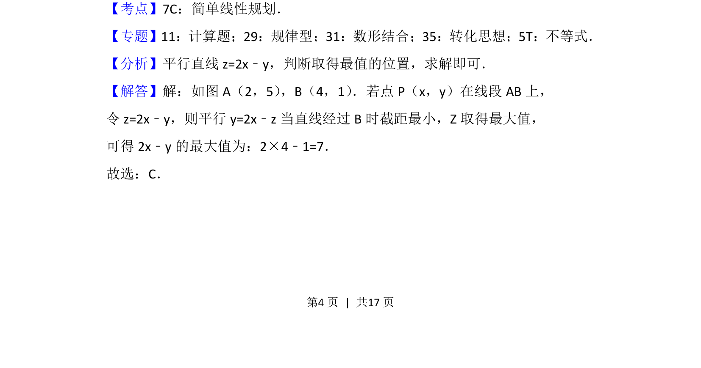
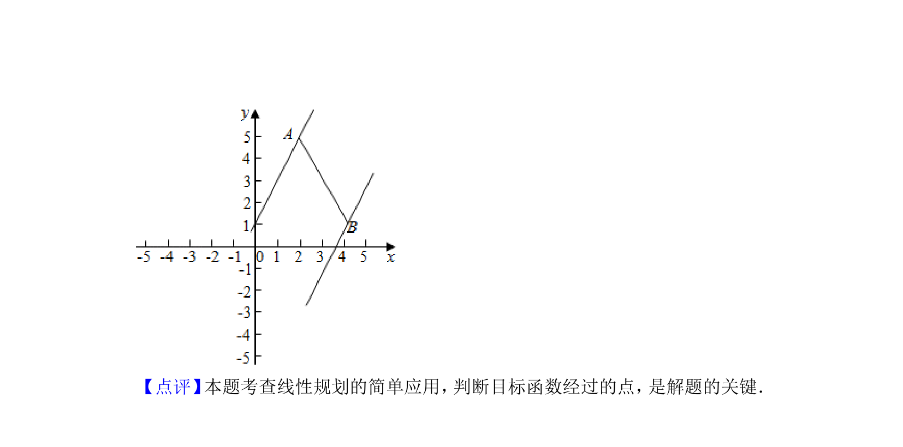

## 题面

## 摘要

给定两点，求动点在线段上时线性目标函数的最值问题

## 关联考点

- [[1075-简单线性规划|简单线性规划]]
- [[898-数形结合|数形结合]]
- [[286-函数的最值|最值]]

## 答案与解析

> 📄 原 PDF 第 4 页：`素材/真题/北京/2008-2024·（北京）数学高考真题/2016年高考数学试卷（文）（北京）（解析卷）.pdf`
