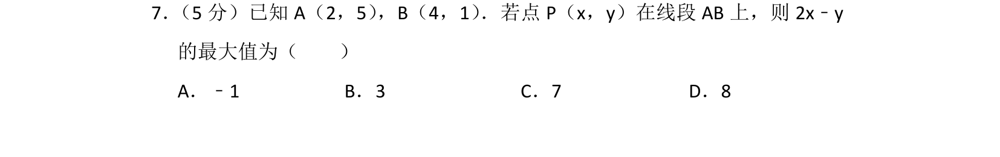
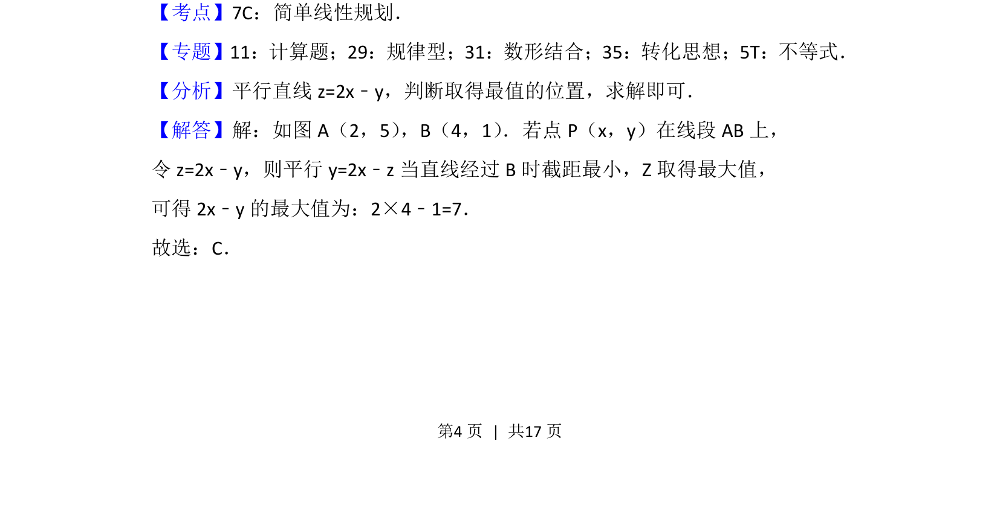
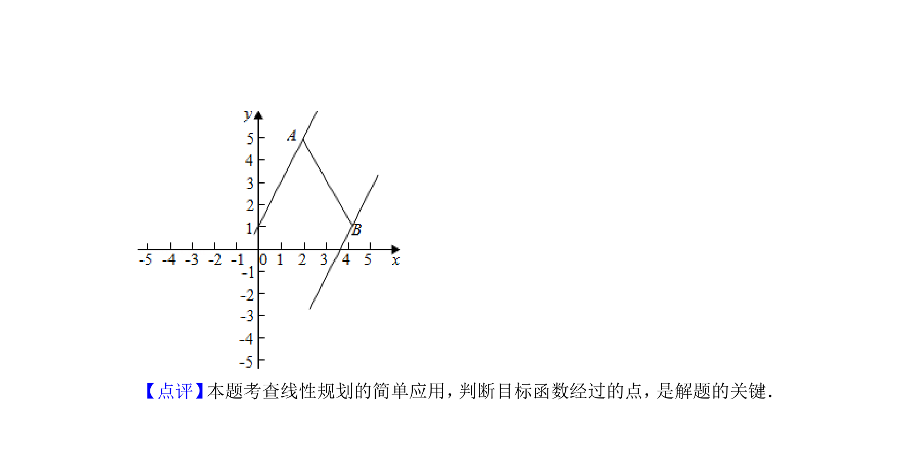

## 题面

## 摘要

给定两点，求动点在线段上时线性目标函数的最值问题

## 关联考点

- [[1074-简单线性规划|简单线性规划]]
- [[897-数形结合|数形结合]]
- [[286-函数的最值|最值]]

## 答案与解析

> 📄 原 PDF 第 4 页：`素材/真题/北京/2008-2024·（北京）数学高考真题/2016年高考数学试卷（文）（北京）（解析卷）.pdf`

<!-- 题干文本-start -->
## 题干文本
7． （5分）已知A（2，5） ，B（4，1） ．若点P（x，y）在线段AB上，则2x﹣y
的最大值为（　　）
A．﹣1 B．3 C．7 D．8
<!-- 题干文本-end -->

<!-- 解析文本-start -->
## 解析文本
【考点】7C：简单线性规划．菁优网版权所有
【专题】11：计算题；29：规律型；31：数形结合；35：转化思想；5T：不等式．
【分析】平行直线z=2x﹣y，判断取得最值的位置，求解即可．
【解答】解：如图A（2，5） ，B（4，1） ．若点P（x，y）在线段AB上，
令z=2x﹣y，则平行y=2x﹣z当直线经过B时截距最小，Z取得最大值，
可得2x﹣y的最大值为：2×4﹣1=7．
故选：C．
<!-- 解析文本-end -->
