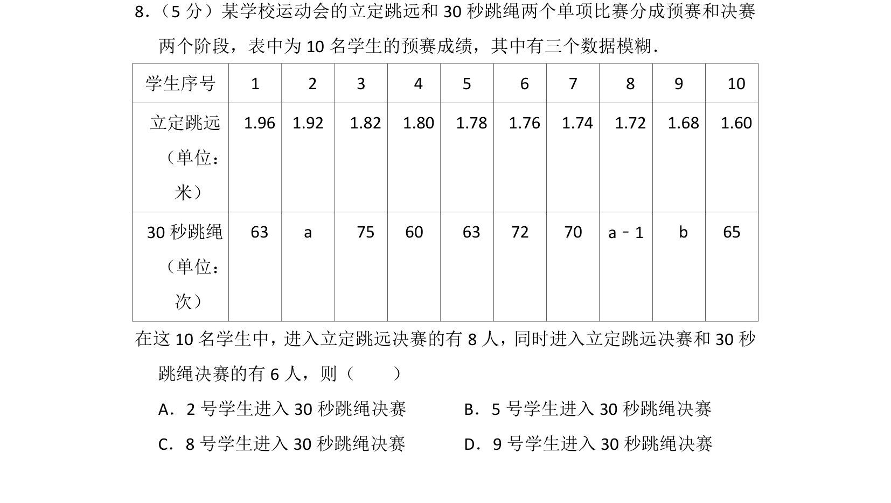
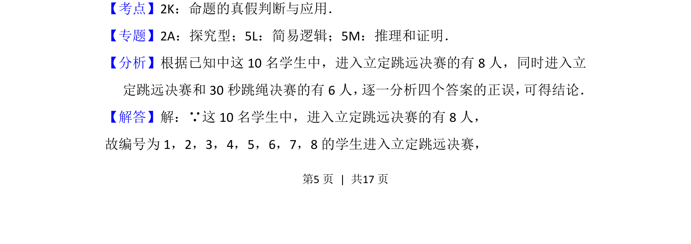
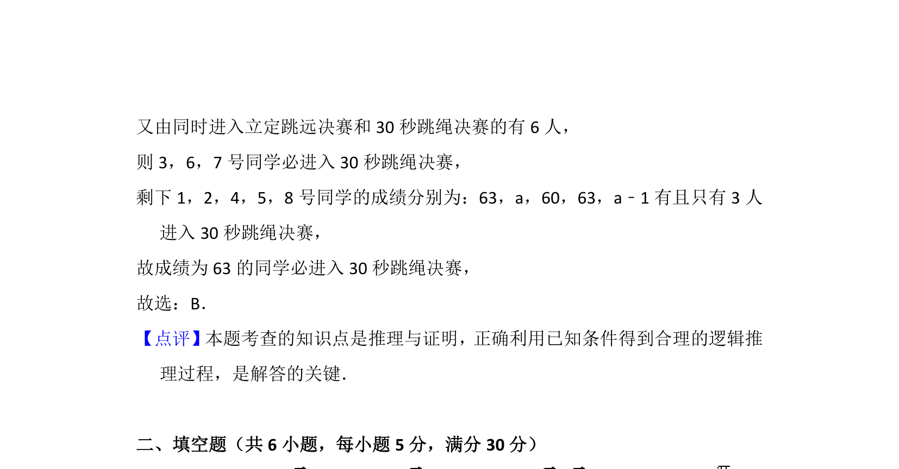

## 题面

## 摘要

该题通过预赛成绩与决赛入围规则，判断关于学生进入30秒跳绳决赛的命题真伪。

## 关联考点

- [[765-命题真假判断|命题真假判断]]
- [[037-推理|逻辑推理]]
- [[集合关系]]

## 答案与解析

> 📄 原 PDF 第 5 页：`素材/真题/北京/2008-2024·（北京）数学高考真题/2016年高考数学试卷（文）（北京）（解析卷）.pdf`
