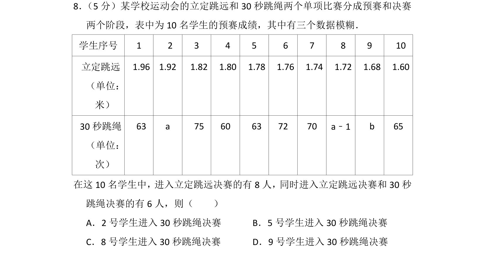
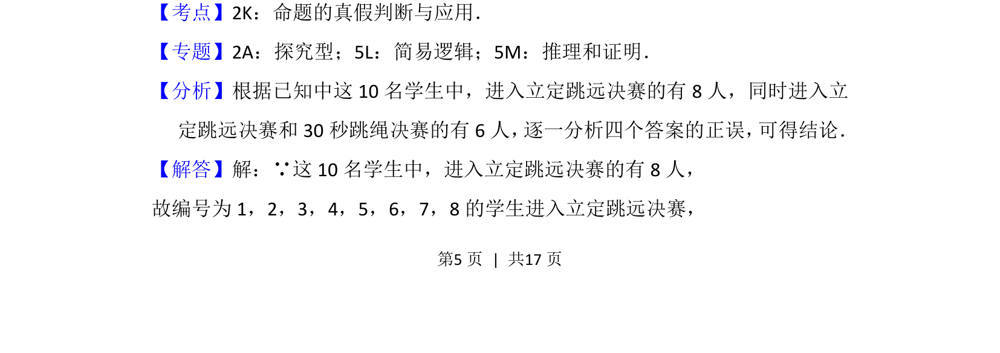
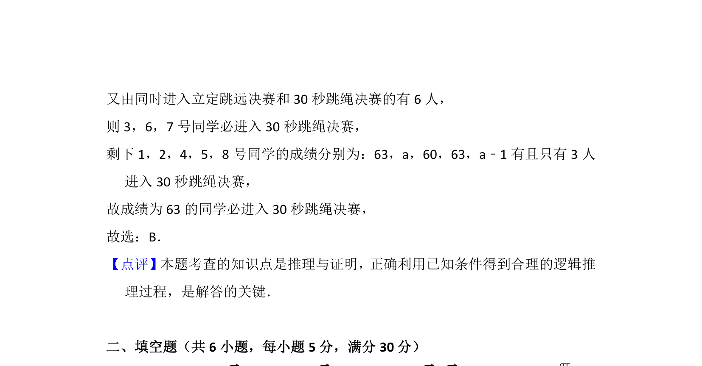

## 题面

## 摘要

该题通过预赛成绩与决赛入围规则，判断关于学生进入30秒跳绳决赛的命题真伪。

## 关联考点

- [[765-命题真假判断|命题真假判断]]
- [[037-推理|逻辑推理]]
- [[集合关系]]

## 答案与解析

> 📄 原 PDF 第 5 页：`素材/真题/北京/2008-2024·（北京）数学高考真题/2016年高考数学试卷（文）（北京）（解析卷）.pdf`

<!-- 题干文本-start -->
## 题干文本
8． （5分）某学校运动会的立定跳远和30秒跳绳两个单项比赛分成预赛和决赛
两个阶段，表中为10名学生的预赛成绩，其中有三个数据模糊．
学生序号 1  2 3  4 5  6 7  8 9  10
 立定跳远
（单位：
米）
 1.96 1.92  1.82  1.80  1.78  1.76  1.74  1.72  1.68  1.60
 30秒跳绳
（单位：
次）
 63 a  75 60  63 72 70 a﹣1  b 65 
在这10名学生中，进入立定跳远决赛的有8人，同时进入立定跳远决赛和30秒
跳绳决赛的有6人，则（　　）
A．2号学生进入30秒跳绳决赛B．5号学生进入30秒跳绳决赛
C．8号学生进入30秒跳绳决赛D．9号学生进入30秒跳绳决赛
<!-- 题干文本-end -->

<!-- 解析文本-start -->
## 解析文本
【考点】2K：命题的真假判断与应用．菁优网版权所有
【专题】2A：探究型；5L：简易逻辑；5M：推理和证明．
【分析】根据已知中这10名学生中，进入立定跳远决赛的有8人，同时进入立
定跳远决赛和30秒跳绳决赛的有6人， 逐一分析四个答案的正误， 可得结论．
【解答】解：∵这10名学生中，进入立定跳远决赛的有8人，
故编号为1，2，3，4，5，6，7，8的学生进入立定跳远决赛，
<!-- 解析文本-end -->
