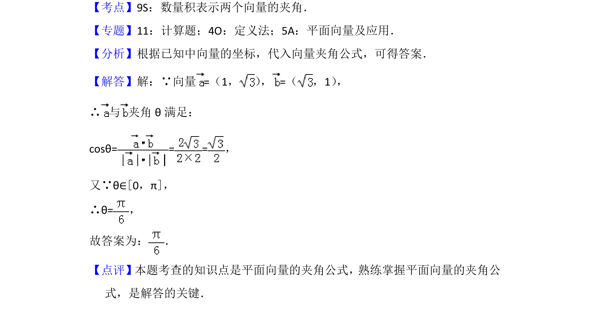

## 题面

## 摘要

根据向量坐标，利用数量积和夹角公式计算两向量夹角。

## 关联考点

- [[595-数量积表示两个向量的夹角|数量积表示两个向量的夹角]]
- [[335-平面向量坐标运算|平面向量坐标运算]]
- [[816-夹角公式|夹角公式]]

## 答案与解析

> 📄 原 PDF 第 6 页：`素材/真题/北京/2008-2024·（北京）数学高考真题/2016年高考数学试卷（文）（北京）（解析卷）.pdf`
