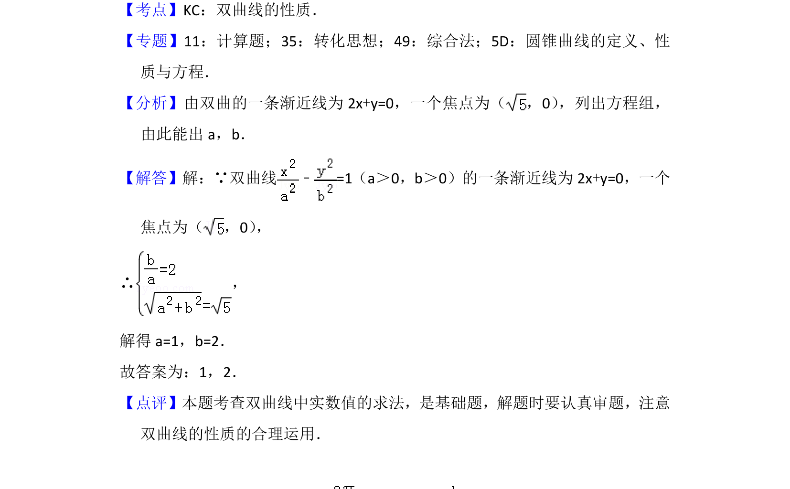

## 题面

## 摘要

已知双曲线渐近线和焦点坐标，求参数a、b的值。

## 关联考点

- [[732-双曲线的标准方程|双曲线的标准方程]]
- [[369-双曲线渐近线|渐近线]]
- [[1217-焦点坐标|焦点坐标]]

## 答案与解析

> 📄 原 PDF 第 8 页：`素材/真题/北京/2008-2024·（北京）数学高考真题/2016年高考数学试卷（文）（北京）（解析卷）.pdf`
