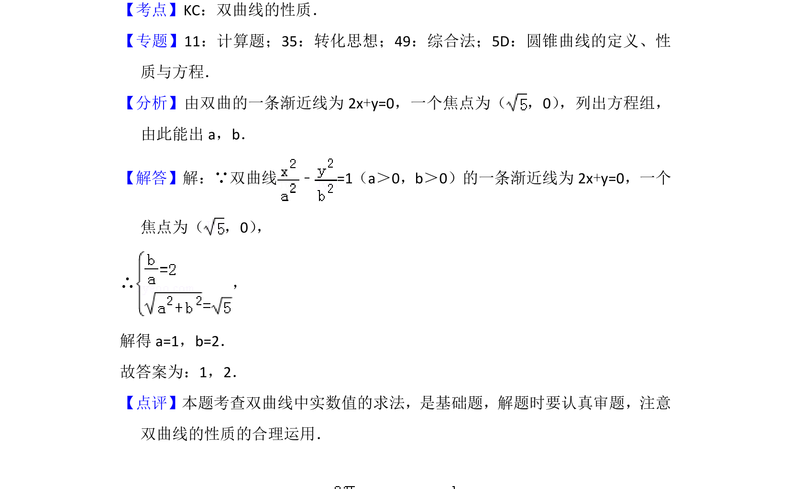

## 题面

## 摘要

已知双曲线渐近线和焦点坐标，求参数a、b的值。

## 关联考点

- [[732-双曲线的标准方程|双曲线的标准方程]]
- [[369-双曲线渐近线|渐近线]]
- [[1217-焦点坐标|焦点坐标]]

## 答案与解析

> 📄 原 PDF 第 8 页：`素材/真题/北京/2008-2024·（北京）数学高考真题/2016年高考数学试卷（文）（北京）（解析卷）.pdf`

<!-- 题干文本-start -->
## 题干文本
12． （5分）已知双曲线﹣=1（a＞0，b＞0）的一条渐近线为2x+y=0，一
个焦点为（ ，0） ，则a=　1　，b=　2　．
<!-- 题干文本-end -->

<!-- 解析文本-start -->
## 解析文本
【考点】KC：双曲线的性质．菁优网版权所有
【专题】11：计算题；35：转化思想；49：综合法；5D：圆锥曲线的定义、性
质与方程．
【分析】由双曲的一条渐近线为2x+y=0，一个焦点为（ ，0） ，列出方程组，
由此能出a，b．
【解答】解：∵双曲线﹣=1（a＞0，b＞0）的一条渐近线为2x+y=0，一个
焦点为（ ，0） ，
∴ ，
解得a=1，b=2．
故答案为：1，2．
【点评】本题考查双曲线中实数值的求法，是基础题，解题时要认真审题，注意
双曲线的性质的合理运用．
<!-- 解析文本-end -->
