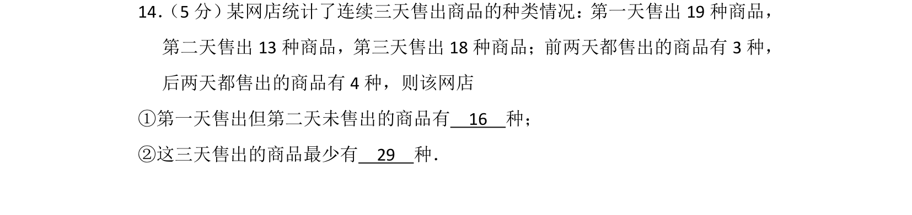
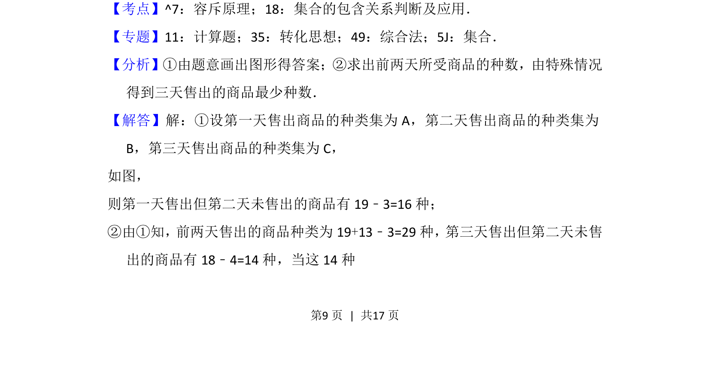
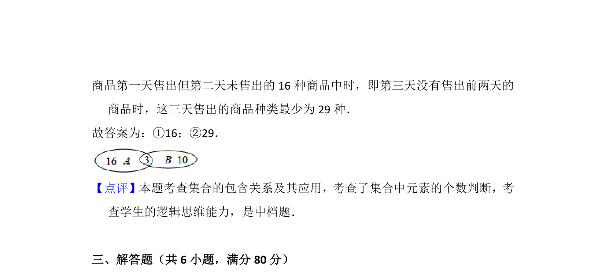

## 题面

## 摘要

该题考查利用集合和容斥原理分析三天售出商品种类的问题，涉及图形辅助推理。

## 关联考点

- [[314-集合的运算|集合运算]]
- [[容斥原理]]

## 答案与解析

> 📄 原 PDF 第 9 页：`素材/真题/北京/2008-2024·（北京）数学高考真题/2016年高考数学试卷（文）（北京）（解析卷）.pdf`

<!-- 题干文本-start -->
## 题干文本
14． （5分）某网店统计了连续三天售出商品的种类情况：第一天售出19种商品，
第二天售出13种商品，第三天售出18种商品；前两天都售出的商品有3种，
后两天都售出的商品有4种，则该网店
①第一天售出但第二天未售出的商品有　16　种；
②这三天售出的商品最少有　29　种．
<!-- 题干文本-end -->

<!-- 解析文本-start -->
## 解析文本
【考点】^7：容斥原理；18：集合的包含关系判断及应用．菁优网版权所有
【专题】11：计算题；35：转化思想；49：综合法；5J：集合．
【分析】①由题意画出图形得答案；②求出前两天所受商品的种数，由特殊情况
得到三天售出的商品最少种数．
【解答】解：①设第一天售出商品的种类集为A，第二天售出商品的种类集为
B，第三天售出商品的种类集为C，
如图，
则第一天售出但第二天未售出的商品有19﹣3=16种；
②由①知，前两天售出的商品种类为19+13﹣3=29种，第三天售出但第二天未售
出的商品有18﹣4=14种，当这14种
<!-- 解析文本-end -->
