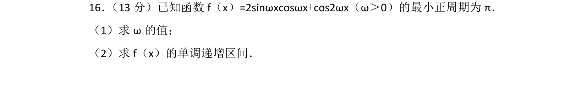
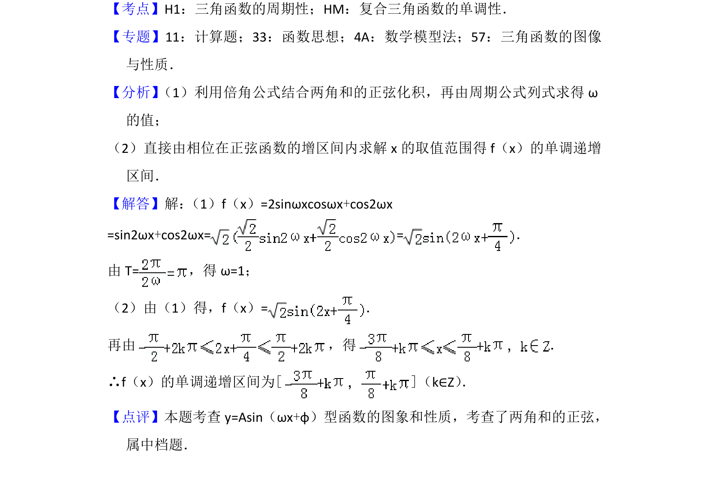

## 题面

## 摘要

已知函数为含倍角和两角和的正弦型函数，求其周期对应的参数ω及单调递增区间

## 关联考点

- [[611-三角函数的周期性|三角函数的周期性]]
- [[1374-复合三角函数的单调性|复合三角函数的单调性]]
- [[倍角公式]]
- [[两角和的正弦]]

## 答案与解析

> 📄 原 PDF 第 11 页：`素材/真题/北京/2008-2024·（北京）数学高考真题/2016年高考数学试卷（文）（北京）（解析卷）.pdf`
