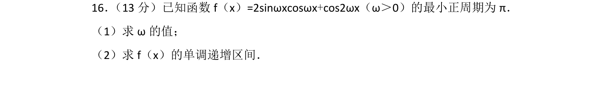
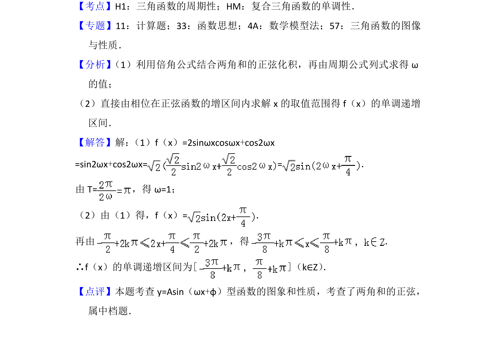

## 题面

## 摘要

已知函数为含倍角和两角和的正弦型函数，求其周期对应的参数ω及单调递增区间

## 关联考点

- [[611-三角函数的周期性|三角函数的周期性]]
- [[1374-复合三角函数的单调性|复合三角函数的单调性]]
- [[倍角公式]]
- [[两角和的正弦]]

## 答案与解析

> 📄 原 PDF 第 11 页：`素材/真题/北京/2008-2024·（北京）数学高考真题/2016年高考数学试卷（文）（北京）（解析卷）.pdf`

<!-- 题干文本-start -->
## 题干文本
16． （13分）已知函数f（x）=2sinωxcosωx+cos2ωx（ω＞0）的最小正周期为π．
（1）求ω的值；
（2）求f（x）的单调递增区间．
<!-- 题干文本-end -->

<!-- 解析文本-start -->
## 解析文本
【考点】H1：三角函数的周期性；HM：复合三角函数的单调性．菁优网版权所有
【专题】11：计算题；33：函数思想；4A：数学模型法；57：三角函数的图像
与性质．
【分析】 （1）利用倍角公式结合两角和的正弦化积，再由周期公式列式求得ω
的值；
（2）直接由相位在正弦函数的增区间内求解x的取值范围得f（x）的单调递增
区间．
【解答】解： （1）f（x）=2sinωxcosωx+cos2ωx
=sin2ωx+cos2ωx==．
由T=，得ω=1；
（2）由（1）得，f（x）=．
再由 ，得 ．
∴f（x）的单调递增区间为[ ]（k∈Z） ．
【点评】本题考查y=Asin（ωx+φ）型函数的图象和性质，考查了两角和的正弦，
属中档题．
<!-- 解析文本-end -->
