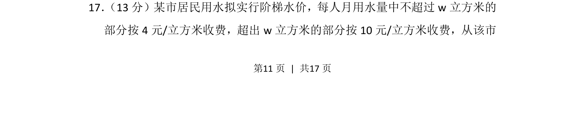
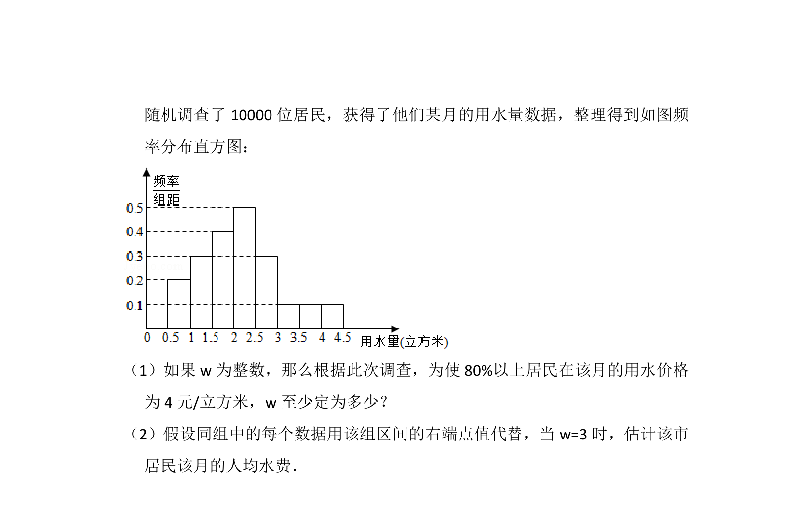
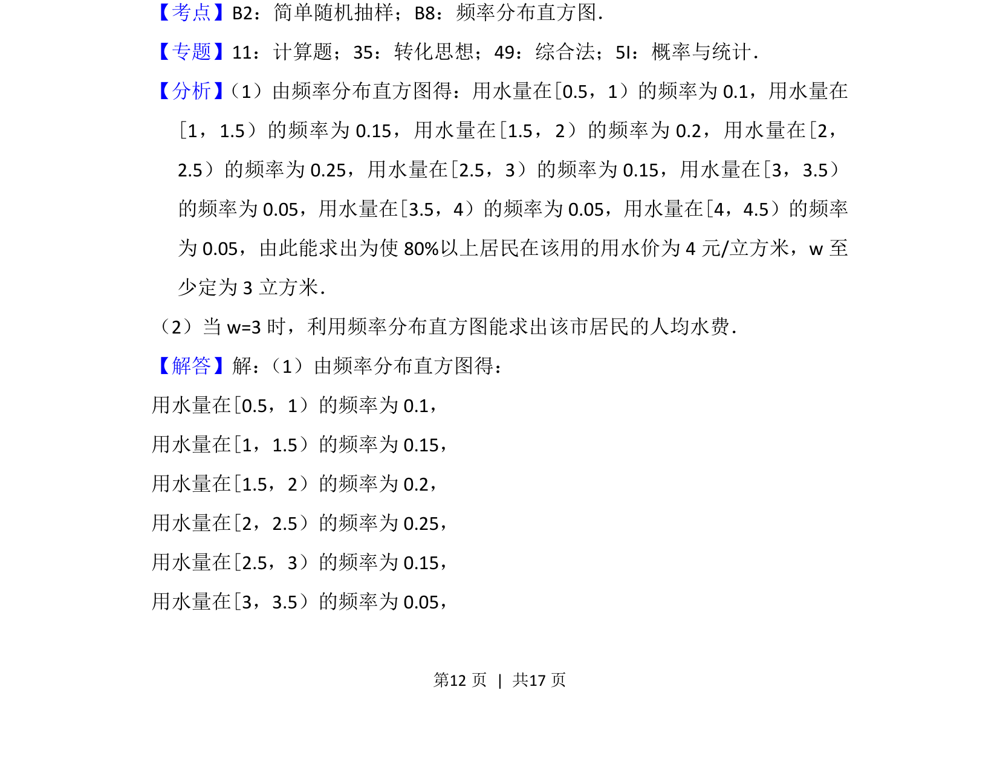
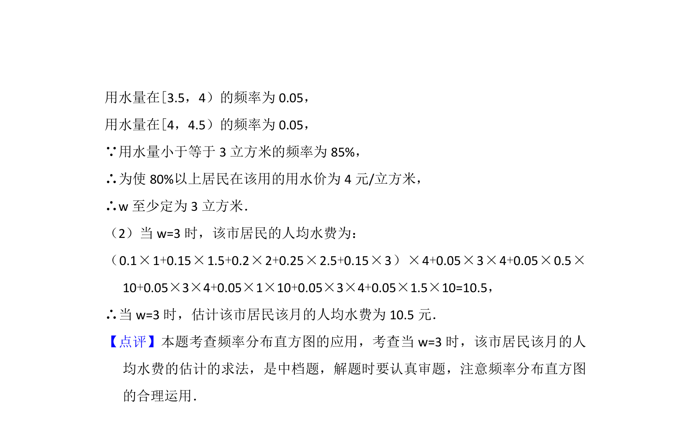

## 题面

## 摘要

本题以阶梯水价为背景，考查分段函数模型与不等式的实际应用。

## 关联考点

- [[分段函数模型]]
- [[114-一元一次不等式|一元一次不等式]]
- [[826-实际应用|实际应用]]

## 答案与解析

> 📄 原 PDF 第 11 页：`素材/真题/北京/2008-2024·（北京）数学高考真题/2016年高考数学试卷（文）（北京）（解析卷）.pdf`
