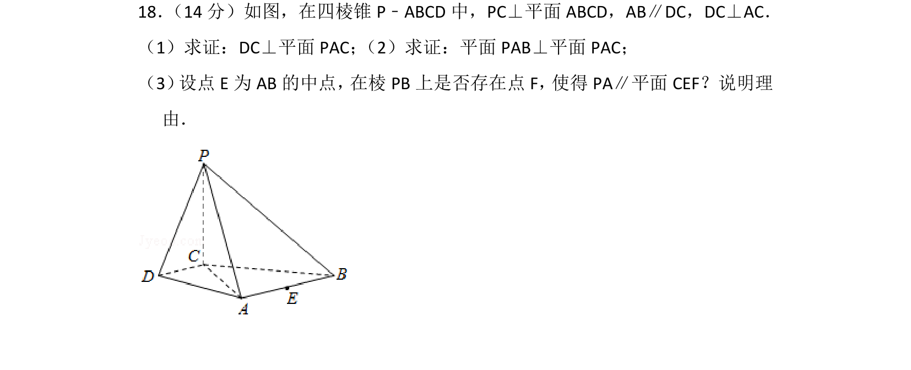
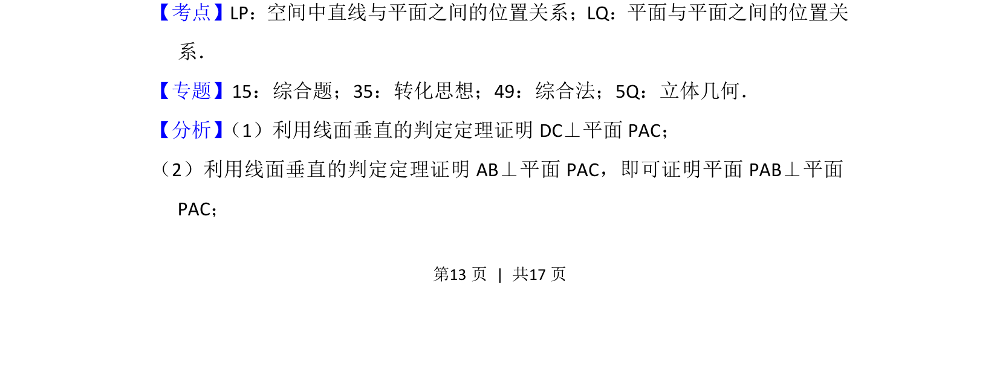
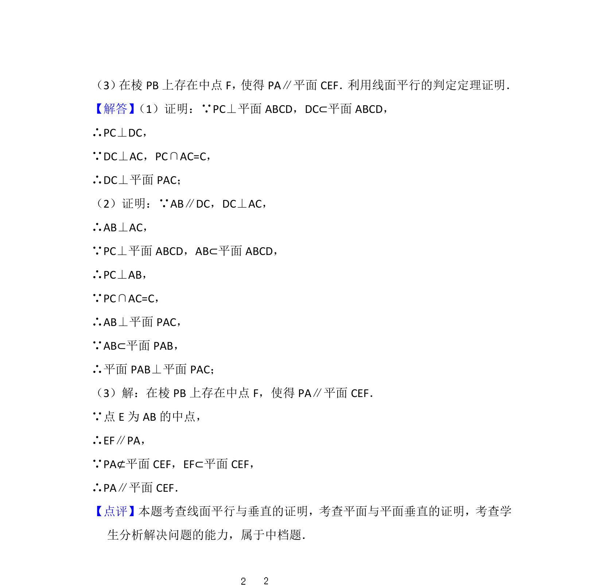

## 题面

## 摘要

该题考查线面垂直、面面垂直的证明以及线面平行的探索性问题，涉及空间中点线面位置关系的综合运用。

## 关联考点

- [[1085-线面垂直的判定|线面垂直的判定]]
- [[1149-面面垂直的判定|面面垂直的判定]]
- [[线面平行的探索]]

## 答案与解析

> 📄 原 PDF 第 13 页：`素材/真题/北京/2008-2024·（北京）数学高考真题/2016年高考数学试卷（文）（北京）（解析卷）.pdf`
