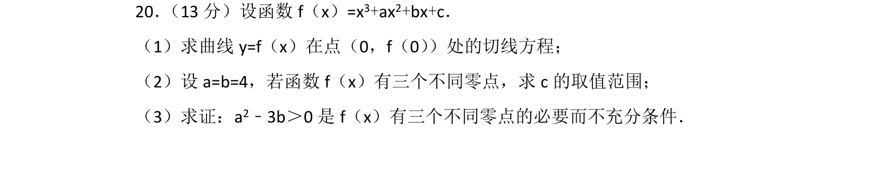
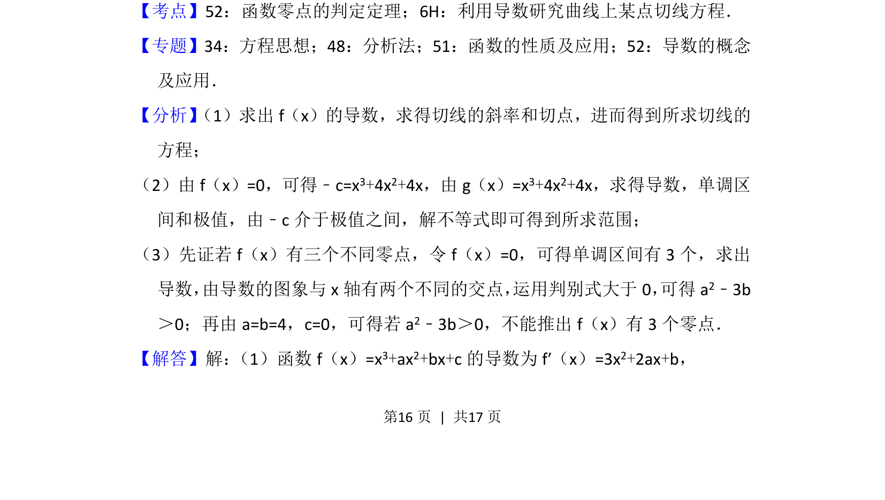
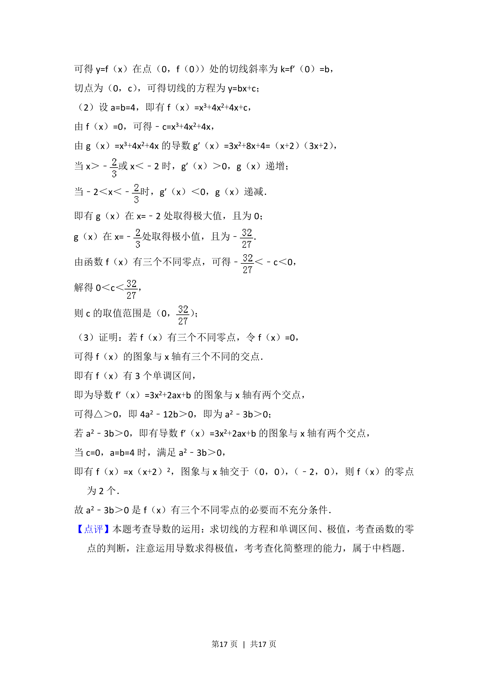

## 题面

## 摘要

考查利用导数求切线方程、三次函数零点个数问题及必要不充分条件的论证。

## 关联考点

- [[425-反函数导数|导数]]
- [[422-切线方程|切线方程]]
- [[288-函数零点|函数零点]]
- [[必要不充分条件]]

## 答案与解析

> 📄 原 PDF 第 16 页：`素材/真题/北京/2008-2024·（北京）数学高考真题/2016年高考数学试卷（文）（北京）（解析卷）.pdf`
