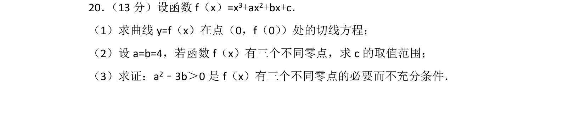
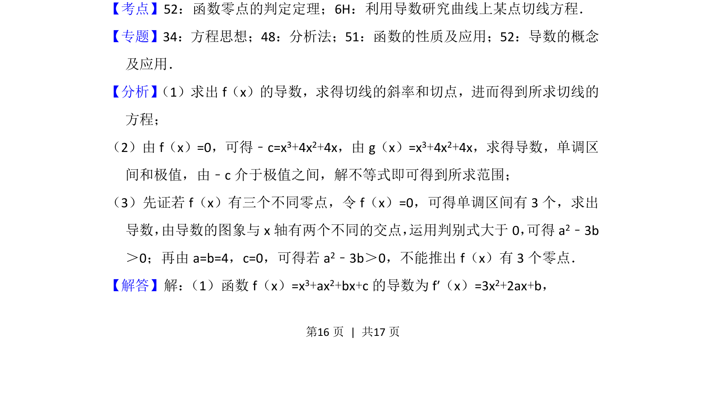
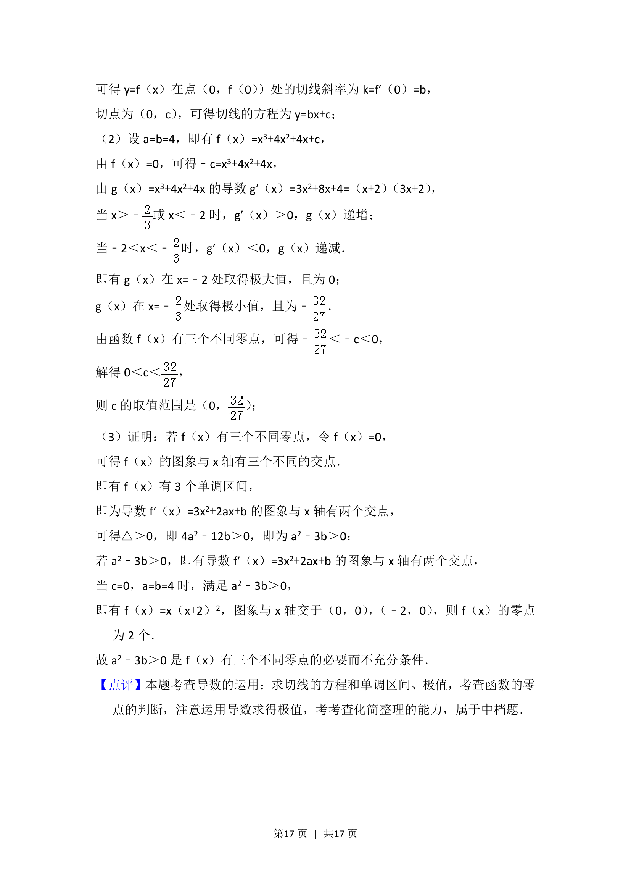

## 题面

## 摘要

考查利用导数求切线方程、三次函数零点个数问题及必要不充分条件的论证。

## 关联考点

- [[425-反函数导数|导数]]
- [[422-切线方程|切线方程]]
- [[288-函数零点|函数零点]]
- [[必要不充分条件]]

## 答案与解析

> 📄 原 PDF 第 16 页：`素材/真题/北京/2008-2024·（北京）数学高考真题/2016年高考数学试卷（文）（北京）（解析卷）.pdf`

<!-- 题干文本-start -->
## 题干文本
20． （13分）设函数f（x）=x3+ax2+bx+c．
（1）求曲线y=f（x）在点（0，f（0） ）处的切线方程；
（2）设a=b=4，若函数f（x）有三个不同零点，求c的取值范围；
（3）求证：a2﹣3b＞0是f（x）有三个不同零点的必要而不充分条件．
<!-- 题干文本-end -->

<!-- 解析文本-start -->
## 解析文本
【考点】52：函数零点的判定定理；6H：利用导数研究曲线上某点切线方程．菁优网版权所有
【专题】34：方程思想；48：分析法；51：函数的性质及应用；52：导数的概念
及应用．
【分析】 （1）求出f（x）的导数，求得切线的斜率和切点，进而得到所求切线的
方程；
（2）由f（x）=0，可得﹣c=x3+4x2+4x，由g（x）=x 3+4x2+4x，求得导数，单调区
间和极值，由﹣c介于极值之间，解不等式即可得到所求范围；
（3）先证若f（x）有三个不同零点，令f（x）=0，可得单调区间有3个，求出
导数， 由导数的图象与x轴有两个不同的交点， 运用判别式大于0， 可得a2﹣3b
＞0；再由a=b=4，c=0，可得若a 2﹣3b＞0，不能推出f（x）有3个零点．
【解答】解： （1）函数f（x）=x3+ax2+bx+c的导数为f′（x）=3x 2+2ax+b，
<!-- 解析文本-end -->
