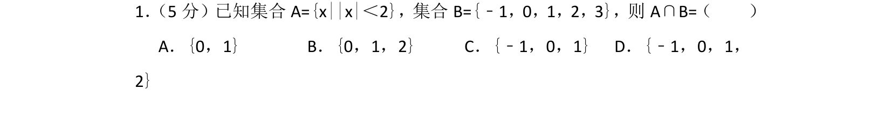
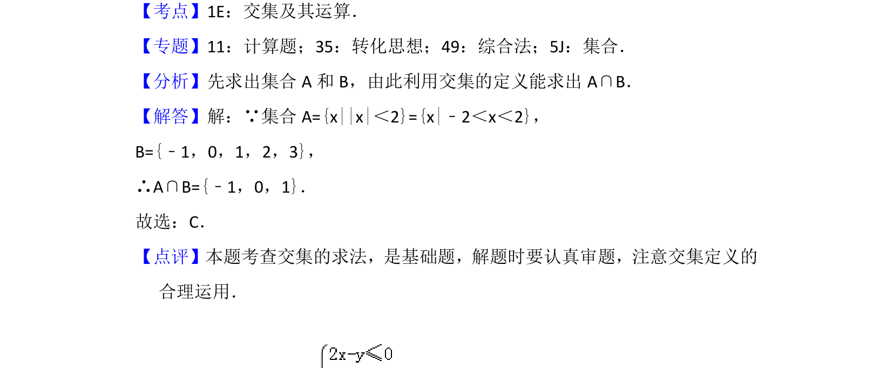

## 题面

## 摘要

求绝对值不等式的解集并计算集合的交集

## 关联考点

- [[1092-绝对值不等式|绝对值不等式]]
- [[1139-集合的交集|集合的交集]]
- [[314-集合的运算|集合运算]]

## 答案与解析

> 📄 原 PDF 第 1 页：`素材/真题/北京/2008-2024·（北京）数学高考真题/2016年高考数学试卷（理）（北京）（解析卷）.pdf`

<!-- 题干文本-start -->
## 题干文本
1． （5分）已知集合A={x||x|＜2}，集合B={﹣1，0，1，2，3}，则A∩B=（　　）
A．{0，1}B．{0，1，2}C．{﹣1，0，1}D．{﹣1，0，1，
2}
<!-- 题干文本-end -->

<!-- 解析文本-start -->
## 解析文本
【考点】1E：交集及其运算．菁优网版权所有
【专题】11：计算题；35：转化思想；49：综合法；5J：集合．
【分析】先求出集合A和B，由此利用交集的定义能求出A∩B．
【解答】解：∵集合A={x||x|＜2}={x|﹣2＜x＜2}，
B={﹣1，0，1，2，3}，
∴A∩B={﹣1，0，1}．
故选：C．
【点评】本题考查交集的求法，是基础题，解题时要认真审题，注意交集定义的
合理运用．
<!-- 解析文本-end -->
