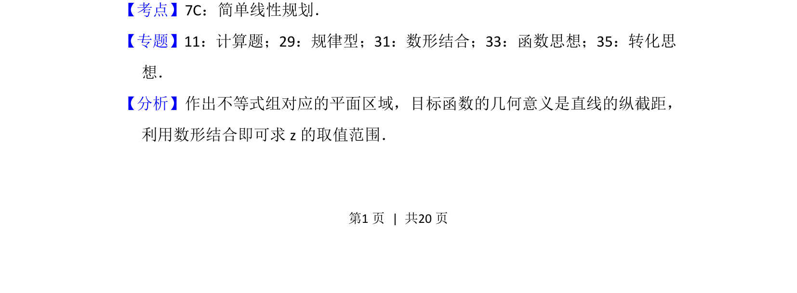
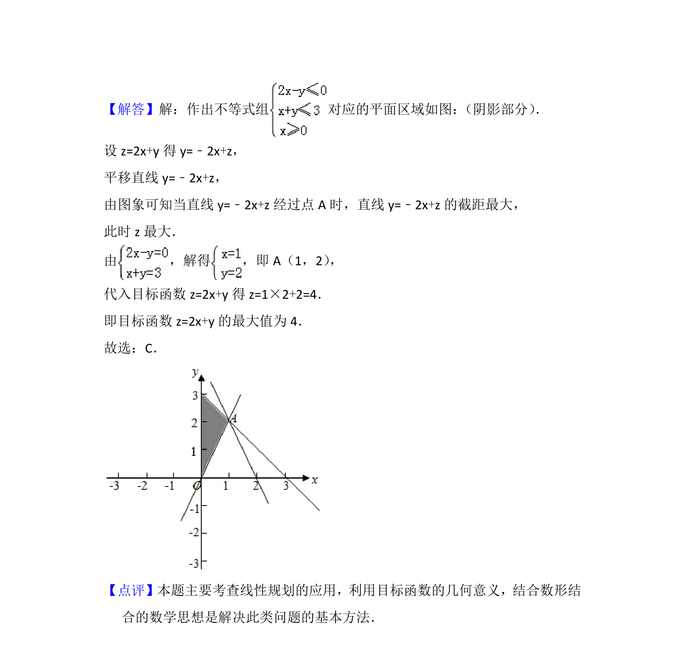

## 题面

## 摘要

考查二元一次不等式组表示的平面区域及线性规划求最值问题。

## 关联考点

- [[1074-简单线性规划|简单线性规划]]
- [[897-数形结合|数形结合]]
- [[1390-目标函数几何意义|目标函数几何意义]]

## 答案与解析

> 📄 原 PDF 第 1 页：`素材/真题/北京/2008-2024·（北京）数学高考真题/2016年高考数学试卷（理）（北京）（解析卷）.pdf`

<!-- 题干文本-start -->
## 题干文本
2． （5分）若x，y满足 ，则2x+y的最大值为（　　）
A．0 B．3 C．4 D．5
<!-- 题干文本-end -->

<!-- 解析文本-start -->
## 解析文本
【考点】7C：简单线性规划．菁优网版权所有
【专题】11：计算题；29：规律型；31：数形结合；33：函数思想；35：转化思
想．
【分析】作出不等式组对应的平面区域，目标函数的几何意义是直线的纵截距，
利用数形结合即可求z的取值范围．
<!-- 解析文本-end -->
