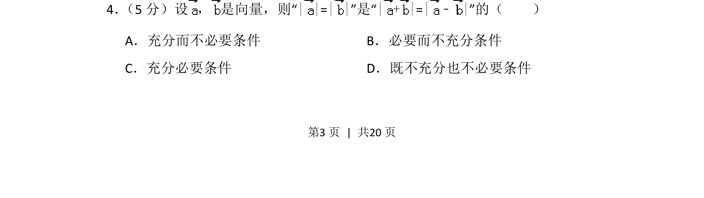
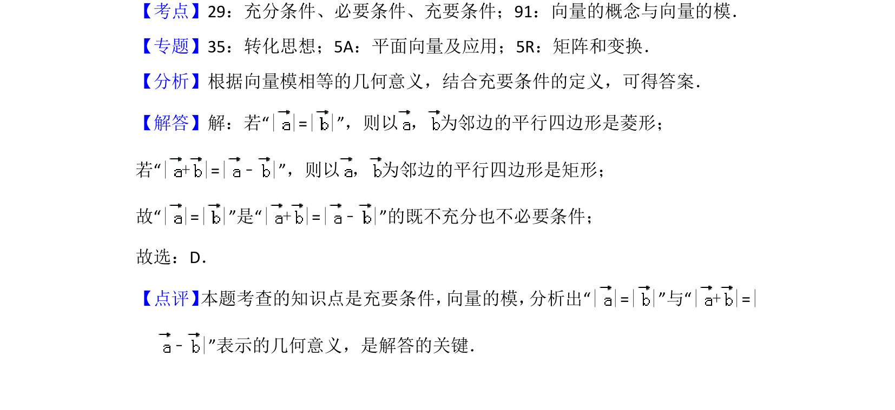

## 题面

## 摘要

考查向量模长相等与向量和差模长关系的充要条件判断

## 关联考点

- [[752-向量模长|向量的模]]
- [[744-向量加减法|向量加减法]]
- [[279-充要条件|充要条件]]

## 答案与解析

> 📄 原 PDF 第 3 页：`素材/真题/北京/2008-2024·（北京）数学高考真题/2016年高考数学试卷（理）（北京）（解析卷）.pdf`
