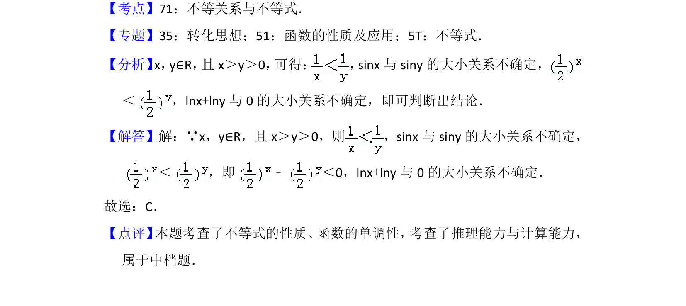

## 题面

## 摘要

利用不等式性质和函数单调性比较大小。

## 关联考点

- [[不等关系与不等式]]
- [[282-函数的单调性|函数的单调性]]

## 答案与解析

> 📄 原 PDF 第 4 页：`素材/真题/北京/2008-2024·（北京）数学高考真题/2016年高考数学试卷（理）（北京）（解析卷）.pdf`

<!-- 题干文本-start -->
## 题干文本
5． （5分）已知x，y∈R，且x＞y＞0，则（　　）
A．﹣＞0 B．sinx﹣siny＞0
C． （ ）x﹣（ ） y＜0 D．lnx+lny＞0
<!-- 题干文本-end -->

<!-- 解析文本-start -->
## 解析文本
【考点】71：不等关系与不等式．菁优网版权所有
【专题】35：转化思想；51：函数的性质及应用；5T：不等式．
【分析】x，y∈R， 且x＞y＞0， 可得： ，sinx与siny的大小关系不确定，
＜ ，lnx+lny与0的大小关系不确定，即可判断出结论．
【解答】解：∵x，y∈R，且x＞y＞0，则 ，sinx与siny的大小关系不确定，
＜ ，即﹣＜0，lnx+lny与0的大小关系不确定．
故选：C．
【点评】 本题考查了不等式的性质、 函数的单调性， 考查了推理能力与计算能力，
属于中档题．
<!-- 解析文本-end -->
