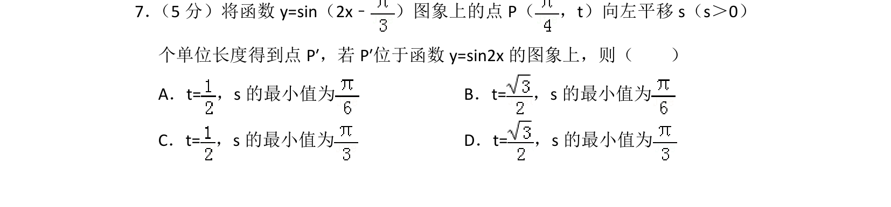
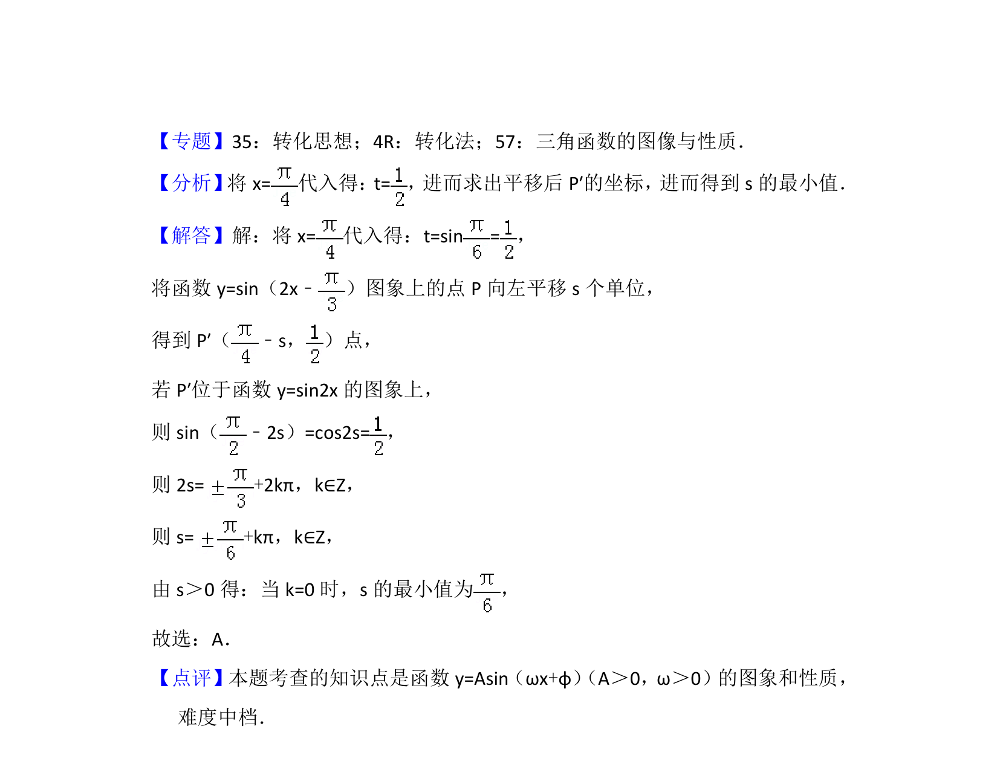

## 题面

## 摘要

本题通过点的平移考查三角函数图象变换，需求解点坐标及平移参数的最小值。

## 关联考点

- [[673-函数y=Asin(ωx+φ)的图象变换|函数y=Asin(ωx+φ)的图象变换]]
- [[310-正弦函数图象与性质|正弦函数]]

## 答案与解析

> 📄 原 PDF 第 5 页：`素材/真题/北京/2008-2024·（北京）数学高考真题/2016年高考数学试卷（理）（北京）（解析卷）.pdf`
