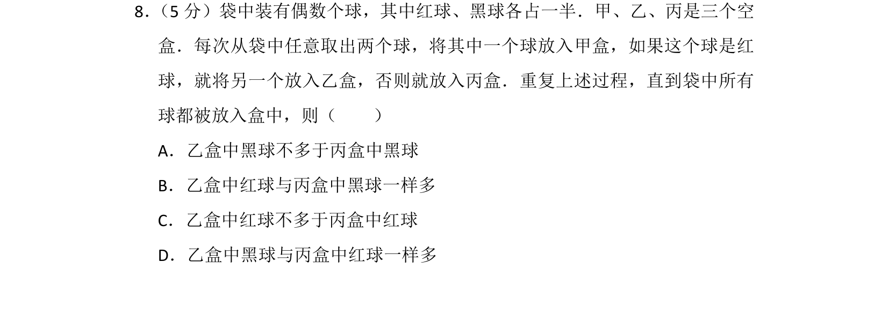
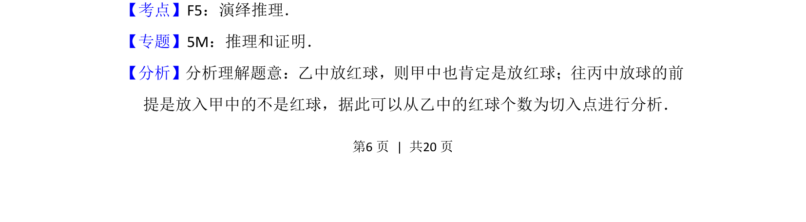
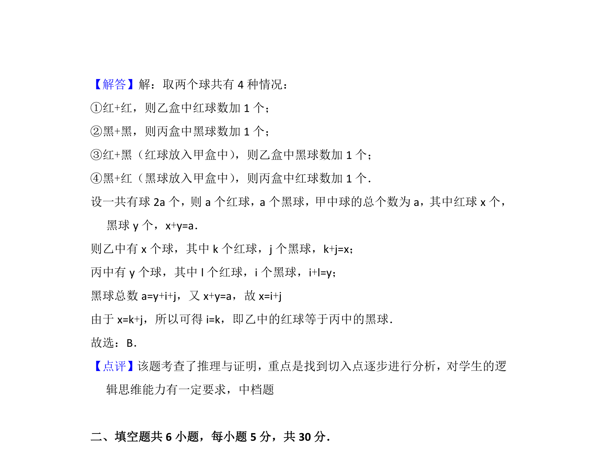

## 题面

## 摘要

袋中取球分盒问题，利用演绎推理分析乙丙盒中红黑球的数量关系。

## 关联考点

- [[037-推理|演绎推理]]
- [[037-推理|逻辑推理]]

## 答案与解析

> 📄 原 PDF 第 6 页：`素材/真题/北京/2008-2024·（北京）数学高考真题/2016年高考数学试卷（理）（北京）（解析卷）.pdf`

<!-- 题干文本-start -->
## 题干文本
8． （5分）袋中装有偶数个球，其中红球、黑球各占一半．甲、乙、丙是三个空
盒．每次从袋中任意取出两个球，将其中一个球放入甲盒，如果这个球是红
球，就将另一个放入乙盒，否则就放入丙盒．重复上述过程，直到袋中所有
球都被放入盒中，则（　　）
A．乙盒中黑球不多于丙盒中黑球
B．乙盒中红球与丙盒中黑球一样多
C．乙盒中红球不多于丙盒中红球
D．乙盒中黑球与丙盒中红球一样多
<!-- 题干文本-end -->

<!-- 解析文本-start -->
## 解析文本
【考点】F5：演绎推理．菁优网版权所有
【专题】5M：推理和证明．
【分析】分析理解题意：乙中放红球，则甲中也肯定是放红球；往丙中放球的前
提是放入甲中的不是红球，据此可以从乙中的红球个数为切入点进行分析．
<!-- 解析文本-end -->
