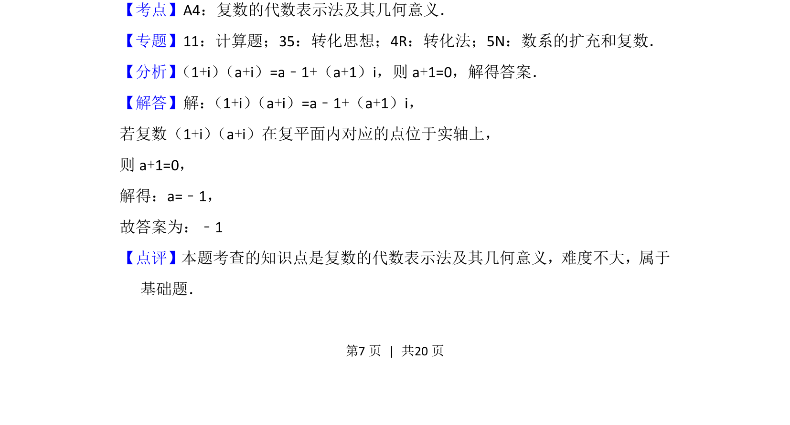

## 题面

## 摘要

该题考查复数的代数运算及其在复平面内对应点的几何意义，通过实轴条件求参数。

## 关联考点

- [[复数的代数运算]]
- [[333-复数的几何意义|复数的几何意义]]
- [[实轴条件]]

## 答案与解析

> 📄 原 PDF 第 7 页：`素材/真题/北京/2008-2024·（北京）数学高考真题/2016年高考数学试卷（理）（北京）（解析卷）.pdf`
