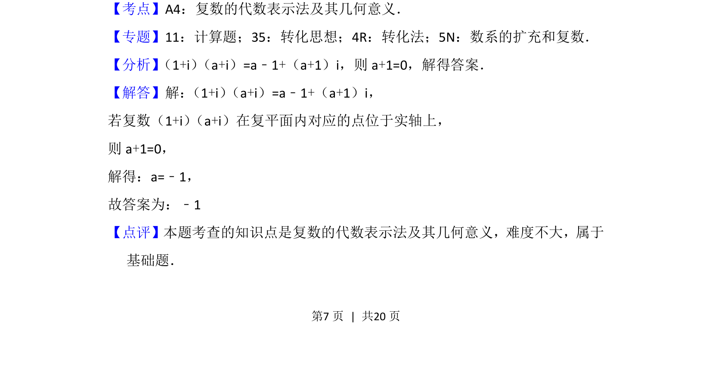

## 题面

## 摘要

该题考查复数的代数运算及其在复平面内对应点的几何意义，通过实轴条件求参数。

## 关联考点

- [[1170-复数代数运算|复数的代数运算]]
- [[333-复数的几何意义|复数的几何意义]]
- [[实轴条件]]

## 答案与解析

> 📄 原 PDF 第 7 页：`素材/真题/北京/2008-2024·（北京）数学高考真题/2016年高考数学试卷（理）（北京）（解析卷）.pdf`

<!-- 题干文本-start -->
## 题干文本
9． （5分）设a∈R，若复数（1+i） （a+i）在复平面内对应的点位于实轴上，则a=　
﹣1　．
<!-- 题干文本-end -->

<!-- 解析文本-start -->
## 解析文本
【考点】A4：复数的代数表示法及其几何意义．菁优网版权所有
【专题】11：计算题；35：转化思想；4R：转化法；5N：数系的扩充和复数．
【分析】 （1+i） （a+i）=a﹣1+（a+1）i，则a+1=0，解得答案．
【解答】解： （1+i） （a+i）=a﹣1+（a+1）i，
若复数（1+i） （a+i）在复平面内对应的点位于实轴上，
则a+1=0，
解得：a=﹣1，
故答案为：﹣1
【点评】 本题考查的知识点是复数的代数表示法及其几何意义， 难度不大， 属于
基础题．
<!-- 解析文本-end -->
