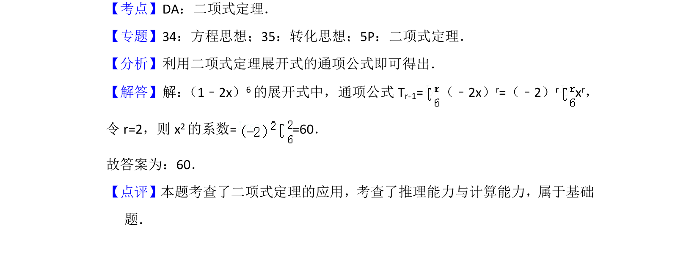

## 题面

## 摘要

二项式定理展开式中指定项的系数计算，利用通项公式求特定次幂系数。

## 关联考点

- [[472-二项式定理|二项式定理]]
- [[384-数列通项公式|通项公式]]
- [[1362-系数计算|系数计算]]

## 答案与解析

> 📄 原 PDF 第 8 页：`素材/真题/北京/2008-2024·（北京）数学高考真题/2016年高考数学试卷（理）（北京）（解析卷）.pdf`
