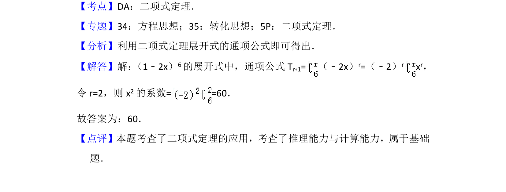

## 题面

## 摘要

二项式定理展开式中指定项的系数计算，利用通项公式求特定次幂系数。

## 关联考点

- [[472-二项式定理|二项式定理]]
- [[384-数列通项公式|通项公式]]
- [[1362-系数计算|系数计算]]

## 答案与解析

> 📄 原 PDF 第 8 页：`素材/真题/北京/2008-2024·（北京）数学高考真题/2016年高考数学试卷（理）（北京）（解析卷）.pdf`

<!-- 题干文本-start -->
## 题干文本
10． （5分）在（1﹣2x）6的展开式中，x2的系数为　60　． （用数字作答）
<!-- 题干文本-end -->

<!-- 解析文本-start -->
## 解析文本
【考点】DA：二项式定理．菁优网版权所有
【专题】34：方程思想；35：转化思想；5P：二项式定理．
【分析】利用二项式定理展开式的通项公式即可得出．
【解答】解： （1﹣2x）6的展开式中，通项公式T r+1=（﹣2x） r=（﹣2）r xr，
令r=2，则x 2的系数= =60．
故答案为：60．
【点评】本题考查了二项式定理的应用，考查了推理能力与计算能力，属于基础
题．
<!-- 解析文本-end -->
