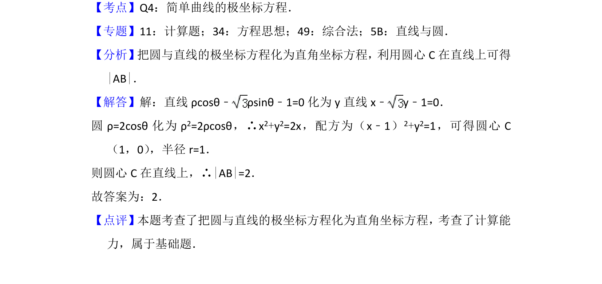

## 题面

## 摘要

将极坐标方程化为直角坐标方程，利用直线过圆心简化求弦长

## 关联考点

- [[920-极坐标与直角坐标互化|极坐标与直角坐标互化]]
- [[394-直线和圆位置关系-高中|直线与圆的位置关系]]
- [[869-弦长计算|弦长计算]]

## 答案与解析

> 📄 原 PDF 第 8 页：`素材/真题/北京/2008-2024·（北京）数学高考真题/2016年高考数学试卷（理）（北京）（解析卷）.pdf`
