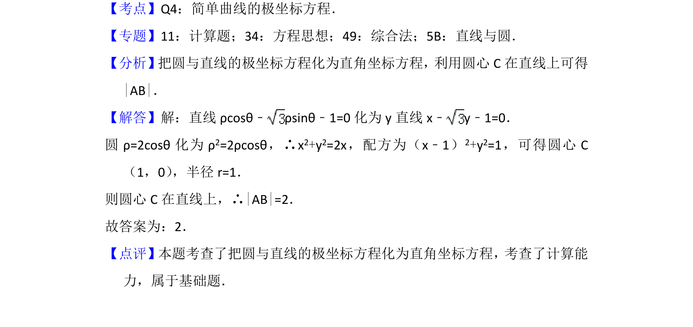

## 题面

## 摘要

将极坐标方程化为直角坐标方程，利用直线过圆心简化求弦长

## 关联考点

- [[920-极坐标与直角坐标互化|极坐标与直角坐标互化]]
- [[394-直线和圆位置关系-高中|直线与圆的位置关系]]
- [[869-弦长计算|弦长计算]]

## 答案与解析

> 📄 原 PDF 第 8 页：`素材/真题/北京/2008-2024·（北京）数学高考真题/2016年高考数学试卷（理）（北京）（解析卷）.pdf`

<!-- 题干文本-start -->
## 题干文本
11． （5分）在极坐标系中，直线ρcosθ﹣ρsinθ﹣1=0与圆ρ=2cosθ交于A，B
两点，则|AB|=　2　．
<!-- 题干文本-end -->

<!-- 解析文本-start -->
## 解析文本
【考点】Q4：简单曲线的极坐标方程．菁优网版权所有
【专题】11：计算题；34：方程思想；49：综合法；5B：直线与圆．
【分析】把圆与直线的极坐标方程化为直角坐标方程，利用圆心C在直线上可得
|AB|．
【解答】解：直线ρcosθ﹣ρsinθ﹣1=0化为y直线x﹣y﹣1=0．
圆ρ=2cosθ化为ρ 2=2ρcosθ，∴x 2+y2=2x，配方为（x﹣1） 2+y2=1，可得圆心C
（1，0） ，半径r=1．
则圆心C在直线上，∴|AB|=2．
故答案为：2．
【点评】本题考查了把圆与直线的极坐标方程化为直角坐标方程，考查了计算能
力，属于基础题．
<!-- 解析文本-end -->
